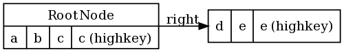
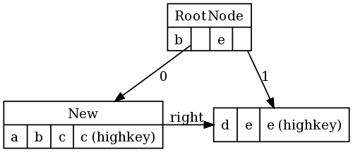

.. -*- coding: utf-8 -*-

--------------------------------
SimpleDBM RSS Developers's Guide
--------------------------------

:Author: Dibyendu Majumdar
:Contact: d.majumdar@gmail.com
:Date: 7 July 2008
:Version: 1.0.8
:Copyright: Copyright by Dibyendu Majumdar, 2005-2008

.. contents::

============
Introduction
============

Overview
========

The goal of SimpleDBM_ project is to build a Relational Database
Manager in Java.

.. _SimpleDBM: http://www.simpledbm.org

It is anticipated that there will be two major sub-systems in the
dbms backend. The Data Manager subsystem (Relational Storage System
or RSS in System R parlance) will be responsible for implementing
low-level stuff such as transactions, locking, buffer management,
table and index management. This is currently implemented.

The second major sub-system will be called SQL Manager (Relational
Data System or RDS). Its job will be to parse SQL statements,
produce optimum execution plans, and execute SQL statements. Development
of the SQL Manager sub-system has not started yet.

Technology
==========
SimpleDBM_ is written in Java and uses features available since version 5.0
of this language.

Third party libraries
---------------------
To void license compatibility issues, and to reduce dependency on
third-party libraries, SimpleDBM_ makes little or no use of any
external libraries. A custom wrapper is used for logging, which uses
the Java logging API by default, but can use Log4J if available.

Obtaining SimpleDBM
-------------------
SimpleDBM_ source can be obtained from the SimpleDBM_ Google project
site http://code.google.com/p/simpledbm/. Source code is maintained in
a Subversion repository, so you will need a subversion client on
your PC.

The SimpleDBM_ SVN repository is organized as follows:

::

 trunk  --+--- simpledbm-rss   	      This contains the core DBMS engine
          |
          +--- simpledbm-typesystem   This contains a simple typesystem
          |                           that can be used with SimpleDBM.
          |
          +--- simpledbm-database     This contains a higher level DB
          |                           API that makes life easier for
          |                           users. It uses the typesystem
          |                           component.
          |
          +--- simpledbm-samples      This contains some sample programs
          |                           that demonstrate how to use SimpleDBM.
          |
          +--- simpledbm-docs         Contains the documentation sources.                           

Under each of the top-level folders, there is the following structure.

::

 --+--- code            This is where the source code is.
   |
   +--- docs            This folder contains documents.
   |
   +--- site            This folder contains web site contents.

Some of these folders may be empty if no content has been created.

In the code sub-directory, there is a top-level directory for each project.

SVN URLs
--------

Here are the SVN URLs for the various SimpleDBM_ sub-systems.

Base URL
  http://simpledbm.googlecode.com/svn/trunk

SimpleDBM-RSS
  ./simpledbm-rss/code/simpledbm-rss

SimpleDBM-TypeSystem
  ./simpledbm-typesystem/code/simpledbm-typesystem

SimpleDBM-Database
  ./simpledbm-database/code/simpledbm-database

TupleDemo sample
  ./simpledbm-samples/code/tupledemo

B-TreeDemo sample
  ./simpledbm-samples/code/btreedemo

If you are a committer, you need to use ``https`` instead of ``http``.

Pre-requisites
--------------

SimpleDBM_ uses Maven_ for build management. You will need to obtain a
copy of Maven 2. Install Maven and set up your PATH so that Maven can be
executed by typing the following command.

:: 
  
  mvn

.. _Maven: http://maven.apache.org.

SimpleDBM_ development is done using Eclipse 3.2. You can use any IDE
of your choice, but you may need to find ways of converting the maven
projects to the format recognized by your IDE.

You will need a Subversion client in order to checkout the code for
SimpleDBM_. The following URL can be used to download the Eclipse subclipse
plugin through the Eclipse Update Manager.

  http://subclipse.tigris.org/update_1.2.x

SimpleDBM_ requires Java SE 5.0 or above. Java SE 6.0 is recommended.
On the Mac, Java SE 5.0 is available for Mac OS X Tiger.

Make sure that Eclipse is setup to use J2SE 5.0 JRE, otherwise,
SimpleDBM_ code will not compile.

Instructions for Eclipse
------------------------
The following instructions are for the simpledbm-rss project.
However, the same instructions apply for the other projects, simply
change the SVN URL as appropriate.

1. Create a new classpath variable named ``M2_REPO`` inside
Eclipse. From the menu bar, select Window > Preferences. Select the Java
> Build Path > Classpath Variables page. The ``M2_REPO`` variable should
contain the path to your local Maven 2 repository. Usually this is
``<Your Home Directory>/.m2/repository``.

2. Create a new SVN repository location in Eclipse
http://simpledbm.googlecode.com/svn/trunk/simpledbm-rss/code.
If you are a committer, use https instead of http.

3. Checkout the folder simpledbm-rss as a project in the
workspace.

4. Start a command shell. Cd to the project directory.

5. Run ``mvn eclipse:clean``, followed by ``mvn eclipse:eclipse``.

6. Switch back to Eclipse and refresh the project. It should now
display a small J against the project showing that it is a Java project. Eclipse
is now setup to automatically rebuild SimpleDBM_ whenever you change any
code.

Maven commands 
--------------
You can also compile, test and do other operations using maven commands.
The following maven commands are commonly used.

To run the test cases.

::

  mvn test

To create the package and install it in the local repository.

::

  mvn install

Test Code Coverage
------------------
I use Clover Code Coverage tool to analyze the coverage of unit test cases.

Installing Clover plug-in in Eclipse
-------------------------------------

The Clover plugin for Eclipse can be downloaded from the Clover
website ``http://www.atlassian.com/software/clover/``. After
downloading, extract the zip file and place contents in your Eclipse
plugins folder. You will need to separately download and install a
license file in the top-level Clover plugin directory. Restart Eclipse
to enable Clover.

Open the Project Properties window, and navigate to the Clover
tab. Click Enable Clover plugin in this project. Click on the
Compilation tab. Enable Fork compiler into separate JVM. Enter the Java
5.0 JDK installation directory in the ``JDK_HOME`` field, and set the Heap
size of the compiler JVM to 64 MB.

In the Clover View, select SimpleDBM_ project, and click on the
button Toggle Compiling with Clover. Now when you build SimpleDBM_ or run
any of the unit tests, Clover will automatically produce coverage data.

Clover support in Maven builds
------------------------------

The SimpleDBM_ Maven build script is already configured for
Clover. You must save the Clover license file to
``src/test/clover/clover.license`` prior to executing mvn.

To build SimpleDBM_ with Clover enabled, and to produce a coverage
report, run: 
::

 mvn clover:instrument clover:clover

The report will be produced in the folder ``target/site/clover``.

============================
Coding and Design Principles
============================

Modular design
==============

SimpleDBM_ is broken down into modules. Each module implements a
particular sub-system, and is contained in its own package.

Each module has a public API, which is specified via a set of Java
interfaces. Classes are generally not used as part of the public API,
though there are a few exceptional cases.

To make the modules reusable and as independent of each other as
possible, the interface of a module is deliberately specified in
general terms. Where possible, direct dependence between modules is
avoided. If two modules are dependent, then the only permissible way
for one module to interact with another is to go via the public
interfaces of the respective modules. Modules are not allowed to
depend upon implementation specifics of other modules.

SimpleDBM_ uses constructor based dependency injection to link
modules. It is being designed in such a way that a third-party IoC
(Inversion of Control) container may be used to manage the
dependencies.

Documentation
=============

Most of the design documentation for SimpleDBM_ is incorporated as
Javadoc comments within the source code, and in package and overview
documents. The aim is to keep the documentation as close to the
source code as possible.

Being an educational project, producing good documentation is high
priority.

Java coding standards
=====================

Heavy use is made of the new concurrency packages in Java 5.0. Enums
are used where appropriate. SimpleDBM_ does not define any Generic
classes itself, but makes liberal use of Java 5.0 Generic classes.

Fine grained thread locking is used to maximize concurrency. Using
coarse grained locking would have simplified the code, but would not
have provided an opportunity for exploring various techniques for
fine-grained locking. Deadlock is avoided by careful ordering of
locks.

Memory management is left to the Garbage Collector. Rather than
using Object pools, SimpleDBM_ encourages the use of short-lived
objects, on the basis that this aids the garbage collector in
reclaiming space more quickly. The aim is to keep permanently
occupied memory to a low level.

Unchecked Exceptions are used. An error message is always logged
before an exception is thrown. This ensures that even if the
exception is not handled by the caller, its occurrence is visible in
the logs.

All error messages are given unique error codes.

Particular attention is paid to cleaning up of resources. To ensure
that resources are cleaned up during normal as well as exceptional
circumstances, finally blocks are used.

Debug messages are used liberally - and are executed conditionally
so that if debug is switched off, there is minimal impact on
performance.

Test Cases
==========

Each module is accompanied with JUnit test cases.

Release schedule
================

The system is designed so that each module is usable once it is
delivered. This means that although the full system has not yet been
constructed, the individual modules can be used as soon as they are
available.

===========================
Data Manager/RSS Components
===========================

The Data Manager/Relational Storage system (RSS) consists of the
components listed in the table given below.

+------------+--------------------------------------------+
|Module Name |Description                                 |
|            |                                            |
+============+============================================+
|Logging     |Provides a Logger implmentation that hides  |
|            |implementation details. Can wrap either JDK |
|            |logging or Log4J.                           |
+------------+--------------------------------------------+
|Utility     |Contains miscellaneous utility classes.     |
+------------+--------------------------------------------+
|Registry    |Provides the Object Registry, which is a    |
|            |factory for creating objects based on type  |
|            |code.                                       |
+------------+--------------------------------------------+
|Storage     |Povides an abstraction for input/output of  |
|Manager     |storage conainers similar to files.         |
+------------+--------------------------------------------+
|Latch       |Provides read/write latches that can be used|
|            |to manage concurrency.                      |
+------------+--------------------------------------------+
|Lock Manager|Implements a Lock Scheduler that allows     |
|            |locking of arbitrary objects. Several       |
|            |different lock modes are supported.         |
+------------+--------------------------------------------+
|Page Manager|The Page Manager defines the page size and  |
|            |provides mapping of pages to storage        |
|            |containers.                                 |
+------------+--------------------------------------------+
|Buffer      |The Buffer Manager module implements the    |
|Manager     |Page Cache where recently accessed pages are|
|            |stoed temporarily.                          |
+------------+--------------------------------------------+
|Log Manager |The Write Ahead Log Manager is used for     |
|            |recording changes made to the database for  |
|            |recovery purposes.                          |
+------------+--------------------------------------------+
|Transaction |The Transaction Manager manages             |
|Manager     |transactions, system restart and recovery.  |
|            |                                            |
+------------+--------------------------------------------+
|Free Space  |The Free Space Maager is responsible for    |
|Manager     |managing free space information in storage  |
|            |containers.                                 |
+------------+--------------------------------------------+
|Slotted Page|The Slotted Page Manager provides an common |
|Manager     |implementation of page containing multiple  |
|            |records. A slot table is used to provide a  |
|            |level of indirection to the records. This   |
|            |allows records to be moved within the page  |
|            |without affecting clients.                  |
+------------+--------------------------------------------+
|Location    |The Location module specifices the inteface |
|            |for identifying lockable records in storage |
|            |containers.                                 |
+------------+--------------------------------------------+
|Index       |Provides efficient structures for accessing |
|Manager     |locations based upon key values.            |
+------------+--------------------------------------------+
|Tuple       |Provides an implementation of tuple         |
|Manager     |containers. A tuple is defined as variable  |
|            |sized blob of data that has a unique        |
|            |identity within the tuple container.        |
+------------+--------------------------------------------+
|Server      |This brings together all the other modules  |
|            |and provides overall management of the      |
|            |SimpleDBM database engine.                  |
+------------+--------------------------------------------+

===============
Object Registry
===============

Overview
========
In any object oriented persistence system, there has to be a
mechanism for creating objects dynamically, given some form of type
identification. SimpleDBM_ uses a simple Object Registry database for
this purpose. Each class that may be dynamically instantiated is
assigned a unique type code. The type code and the associated class
name is registered in the SimpleDBM_ Object Registry. The typecode
can subsequently be used to request an object of the specified
class.

Registering a class
===================

Before an object of a particular type can be instantiated, its class
must be registered with the Object Registry. An example of how this
is done is shown below::

 ObjectFactory objectFactory = new ObjectFactoryImpl();
 objectFactory.registerType(1, String.class.getName());

Above registers the ``String`` class with the Object Registry. It
assigns the type code 1 to the ``String`` class. Objects of the
registered classes may be instantiated using their type codes::

 String t = (String) objectFactory.getInstance(1);

For a class to be eligible for registration, it must implement the
default no-argument constructor.

Registering Singletons
======================

SimpleDBM_'s object registry also supports registration of
singletons. Example::

 ObjectFactory objectFactory = new ObjectFactoryImpl();
 objectFactory.registerSingleton(1, new String("hello"));

Object Registry aware classes
=============================

Some objects may need to obtain instances of other classes. To do
this, objects of such classes need access to the Object Registry. If
a class implements the ``ObjectFactoryAware`` interface, then it
will be injected with the appropriate Object Registry object at the
time of initialisation.

Example::

 class MyObject implements ObjectFactoryAware {
   ObjectFactory objectFactory;
   public void setObjectFactory(ObjectFactory factory) {
     this.objectFactory = factory;
   }
   public MyObject() {
   }
 }

===============
Storage Manager
===============

Overview
========
Database Managers typically use files to store various types of
data, such as, log files, data files, etc. However, from the
perspective of a DBMS, the concept of a file is a logical one; all
the DBMS cares about is a named storage container that supports
random positioned IO. As long as this requirement is met, it is not
important whether a container maps to a file or to some other
device.

The objective of this package is to provide a level of abstraction
to the rest of the DBMS so that the mapping of a container to a file
becomes an implementation artefact. If desired, containers may be
mapped to raw devices, or to segments within a file.

Storage Containers
==================

A Storage Container is a named entity that supports positioned
(random) Input/Output. The default implementation maps a container
to a file, but this is an implementation detail. The rest of the
system does not need to know what the storage container maps to.

In SimpleDBM_, each table or index maps to a single storage
container. The Write Ahead Log also uses storage containers to store
its data. Table and index containers have fixed size pages. The
Write Ahead Log contains variable size records.

Storage Container Registry
==========================

Container names are usually not good identifiers for the rest of the
system. Integer identifiers are better, especially when other
objects need to refer to specific containers. Integers take less
amount of storage, and also remove the dependency between the
container's name and the rest of the system. To support this
requirement, the ``org.simpledbm.rss.api.st.StorageManager``
interface is provided, which maintains a mapping of
StorageContainers to integer identifiers. Note that the Storage
sub-system does not decide how to map the containers to ids; it
merely enables the registration of these mappings and allows
StorageContainer objects to be retrieved using their numeric
identifiers.

::

 StorageContainerFactory storageFactory
    = new FileStorageContainerFactory();
 StorageManager storageManager = new StorageManagerImpl();
 StorageContainer sc = storageFactory.open("dual");
 storageManager.register(0, sc);

Above sample code registers the container named "dual" to the
storage manager and identifies this with the integer value 0. Other
modules may obtain access to the storage container as follows:

::

 StorageContainer sc = storageManager.getInstance(0);

Storable Interface and Object serialization
===========================================

SimpleDBM_ requires some way of serializing and de-serializing
objects from a byte stream. Java provides the java.io.Serializable
interface and associated technology for this, however, the default
mechanism is unsuitable for use in SimpleDBM_. The problem with the
default method is that the language decides how to map type
information to the stream. Since this has to be done in a generic
manner, it cannot be optimised for space. In contrast, SimpleDBM_ can
use the 2-byte short integer type code used in the Object Registry
module to efficiently store type information.

SimpleDBM_ provides the ``org.simpledbm.rss.api.st.Storable``
interface as a substitute for ``java.io.Serializable`` interface.
``Storable`` interface requires the object to be able to predict
its stored size in bytes via the ``getStoredLength()`` method. It
also requires the object to be able to stream itself to a
``ByteBuffer`` object, and also restore its contents from a
``ByteBuffer`` object.

=============
Latch Manager
=============

Overview
========

A Latch is an efficient lock that is used by the system to manage
concurrent access to physical structures. In many ways, Latches are
similar to Mutexes, however, latches supports additional lock modes,
such as Shared locks and Update locks.

Latch modes
===========

SimpleDBM_ implements two types of latches. A ReadWrite Latch
supports two lock modes:

Shared mode
  is compatible with Shared mode but incompatible with Exclusive

Exclusive mode
  incompatible with any other mode.

A ReadWriteUpdate latch is an enhanced version that supports an
additional Update mode lock.

Update mode
  compatible with Shared mode but incompatible with
  Update or Exclusive modes. Note that the Shared mode locks are
  incompatible with Update mode locks.

An Update lock may be upgraded to Exclusive lock, and conversely, an
Exclusive lock may be downgraded to an Update lock. An Update lock
may also be downgraded to a Shared lock.

Implementation and Performance Notes
====================================

The SimpleDBM_ Latch interface is designed to be compatible with the
Java 5.0 ReentrantReadWriteLock interface. This allows the ReadWrite
Latch implementation to be based upon the Java primitive.

The ReadWrite Latch is likely to be more efficient than the
ReadWriteUpdate Latch.

Obtaining a latch instance
==========================

SimpleDBM_ implements a factory class for creating Latch objects. The
factory supports instantiating a ReadWrite latch, or a
ReadWriteUpdate latch. There is also a default mode which results in
ReadWrite latch.

===========
Log Manager
===========

Overview
========
The Write Ahead Log plays a crucial role in a DBMS. It provides the
basis for recoverability. It is also a critical part of the system
that has a massive impact on performance of an OLTP system.

Conceptually, the Log can be thought of as an ever growing
sequential file. In the form of Log Records, the Log contains a
history of all changes made to the database. Each Log Record is
uniquely identified by a number called the Log Sequence Number
(LSN). The LSN is designed in such a way that given an LSN, the
system can locate the corresponding Log Record quickly. LSNs are
assigned in strict ascending order (monotonicity). This is an
important property when it comes to recovery.

During the progress of a Transaction, the a DBMS records in the Log
all the changes made by the transaction. The Log records can be used
to recover the system if there is a failure, or they can be used to
undo the changes made by a transaction.

Initially, Log Records are stored in memory. They are flushed to
disk during transaction commits, and also during checkpoints. In the
event of a crash, it is possible to lose the log records that were
not flushed to disk. This does not cause a problem, however, because
by definition these log records must correspond to changes made by
incomplete transactions. Also, the WAL protocol (described below)
ensures that such Log records do not contain changes that have
already been persisted within the database.

Write Ahead Log (WAL) Protocol
==============================

The WAL protocol requires the following conditions to hold true:

1. All changes made by a transaction must be recorded in the Log 
   and the Log must be flushed to disk before the transaction is 
   committed.

2. A database buffer page may not be modified until its modifications 
   have been logged. A buffer page may not be saved to disk until 
   all its associated log records have been saved to disk.

3. While the buffer page is being modified and the Log is being 
   updated, an Exclusive latch (a type of fast lock) must be held
   on the page to ensure that order in which changes are recorded
   in the Log correspond to the order in which they were made.

Consequences of above rules are:

* If a Log Record was not saved to disk, it can be safely ignored,
  because any changes contained in it are guaranteed to belong to 
  uncommitted transactions. Also, such Log Records cannot represent 
  changes that have been made persistent in the database.

* Log records represent changes to the system in the correct order. 
  The latching protocol ensures that if two Log records represent 
  changes to the same Page, then the ordering of these records 
  reflects the order in which the changes were made to the page.

Advantages of WAL
=================
Typically, in an OLTP system, updates tend to be random and can
affect different parts of the disk at a point in time. In
comparison, writes to the Log are always sequential. If it were
necessary to flush all changes made by the DBMS to disk at commit
time, it would have a massive impact on performance because of the
randomness of the disk writes. However, in a WAL system, only the
Log needs to be flushed to disk at Commit. Thus, the Log has the
effect of transforming random writes into serial writes, thereby
improving performance significantly.

Usage Notes
===========
The Log Manager interface does not make any assumptions about log
records. In fact, it does not specify the format of a log record.

SimpleDBM Implementation of the Log
===================================

The SimpleDBM_ Log maintains control information separately from log
files. For safety, multiple copies of control information are stored
(though at present, only the first control file is used when opening
the Log).

Logically, the Log is organized as a never ending sequence of log
records. Physically, the Log is split up into log files. There is a
fixed set of online log files, and a dynamic set of archived log
files. The set of online log files is called a Log Group.

Each Log Group consists of a set of pre-allocated log files of the
same size. The maximum number of groups possible is 3, and the
maximum number of log files within a group is 8. Note that each
group is a complete set in itself - the Log is recoverable if any
one of the groups is available, and if the archived log files are
available. If more than one group is created, it is expected that
each group will reside on a different disk sub-system.

The Log Groups are allocated when the Log is initially created. The
log files within a group are also pre-allocated. However, the
content of the online log files changes over time.

Logically, in the same way that the Log can be viewed as a sequence
of Log Records, it can also be thought of as a sequence of Log
Files. The Log Files are numbered in sequence, starting from 1. The
Log File sequence number is called LogIndex. At any point in time,
the physical set of online log files will contain a set of logical
log files. For example, if there are 3 physical files in a Log
Group, then at startup, the set of logical log files would be 1, 2
and 3. After some time, the log file 1 would get archived, and in
its place a new logical log file 4 would be created. The set now
would now consist of logical log files 2, 3 and 4.

When a log record is written to disk, it is written out to an online
log file. If there is more than one group, then the log record is
written to each of the groups. The writes happen in sequence to
ensure that if there is a write failure, damage is restricted to one
Log Group. Note that due to the way this works, having more than 1
group will slow down log writes. It is preferable to use hardware
based disk mirroring of log files as opposed to using multiple log
groups.

When new log records are created, they are initially stored in the
log buffers. Log records are written out to log files either because
of a client request to flush the log, or because of the periodic
flush event.

During a flush, the system determines which log file to use. There
is the notion of Current log file, which is where writes are
expected to occur. If the current log file is full, it is put into a
queue for archiving, and the log file is switched. Until an online
log file has been archived, its physical file cannot be reused. A
separate archive thread monitors archive requests and archives log
files in the background.

Only one flush is permitted to execute at any point in time.
Similarly, only one archive is permitted to execute at any point in
time. However, multiple clients are allowed to concurrently insert
and read log records, even while flushing and archiving is going on,
except under following circumstances.

1. Log inserts cannot proceed if the system has used up more
   memory than it should. In that case, it must wait for some memory to
   be freed up. To ensure maximum concurrency, the memory calculation
   is approximate.

2. A Log flush cannot proceed if all the online log files are full.
   In this situation, the flush must wait for at least one file to be
   archived.

3. When reading a log record, if the online log file containing the
   record is being archived, the reader may have to wait for the status
   of the log file to change, before proceeding with the read.
   Conversely, if a read is active, the archive thread must wait for
   the read to be over before changing the status of the log file.

If archive mode is ON, log files are archived before being re-used.
Otherwise, they can be reused if the file is no longer needed -
however this is currently not implemented. By default archive mode
is ON.

Limitations of current design
=============================

A Log record cannot span log files, and it must fit within a single
log buffer. Thus the size of a log record is limited by the size of
a log buffer and by the size of a log file. As a workaround to this
limitation, clients can split the data into multiple log records,
but in that case, clients are responsible for merging the data back
when reading from the Log.

Operations
==========

Creating a new Log Instance
---------------------------
Several parameters must be supplied when creating a new log
instance. These are specified using a Java Properties object.

+-----------------------------------+------------------------------------------------------------+
| Property Name                     | Description                                                |
+===================================+============================================================+
| ``log.ctl.{n}``                   | The fully qualified path to the                            |
|                                   | log control file. The first file should be specified as    |
|                                   | ``log.ctl.1``, second as ``log.ctl.2``, and so on. Up to a |
|                                   | maximum of 3 can be specified. Default is 2.               |
+-----------------------------------+------------------------------------------------------------+
| ``log.groups.{n}.path``           | The path where log files of a group should be stored.      |
|                                   | The first log group is specified as ``log.groups.1.path``, |
|                                   | the second as ``log.groups.2.path``,                       |
|                                   | and so on. Up to a maximum of 3 log groups can be          |
|                                   | specified. Default number of groups is 1. Path defaults    |
|                                   | to current directory.                                      |
+-----------------------------------+------------------------------------------------------------+
| ``log.archive.path``              | Defines the path for storing archive files. Defaults to    | 
|                                   | current directory.                                         |
+-----------------------------------+------------------------------------------------------------+
| ``log.group.files``               | Specifies the number of log files within each group.       |
|                                   | Up to a maximum of 8 are allowed. Defaults to 2.           |
+-----------------------------------+------------------------------------------------------------+
| ``log.file.size``                 | Specifies the size of each log file in                     |
|                                   | bytes. Default is 2 KB.                                    |
+-----------------------------------+------------------------------------------------------------+
| ``log.buffer.size``               | Specifies the size of the log buffer                       |
|                                   | in bytes. Default is 2 KB.                                 |
+-----------------------------------+------------------------------------------------------------+
| ``log.buffer.limit``              | Sets a limit on the maximum number of                      |
|                                   | log buffers that can be allocated. Default is 10 *         |
|                                   | log.group.files.                                           |
+-----------------------------------+------------------------------------------------------------+
| ``log.flush.interval``            | Sets the interval (in seconds)                             |
|                                   | between log flushes. Default is 6 seconds.                 |
+-----------------------------------+------------------------------------------------------------+
| ``log.explicitFlushRequests``     | Boolean value, if set, disables                            |
|                                   | log flushes requested explicitly by the Buffer Manager     |
|                                   | or Transaction Manager. Log flushes still occur during     |
|                                   | checkpoints and log switches. By reducing the log flushes, |
|                                   | performance is improved, but transactions may not be       |
|                                   | durable. Only those transactions will survive a system     | 
|                                   | crash that have all their log records on disk.             |
+-----------------------------------+------------------------------------------------------------+

Here is an example:

::

 LogFactory factory = new LogFactoryImpl();
 Properties properties = new Properties();
 properties.setProperty("log.ctl.1", "ctl.a");
 properties.setProperty("log.ctl.2", "ctl.b");
 properties.setProperty("log.groups.1.path", ".");
 properties.setProperty("log.archive.path", ".");
 properties.setProperty("log.group.files", "3");
 properties.setProperty("log.file.size", "16384");
 properties.setProperty("log.buffer.size", "16384");
 properties.setProperty("log.buffer.limit", "4");
 properties.setProperty("log.flush.interval", "30");
 factory.createLog(properties);

Opening a log instance
----------------------

Once a Log has been created, it can be opened for use. Opening the
log also starts back ground threads that handle periodic log flushes
and archival of log files. When the log is closed, the background
threads are shut down.

Following sample code shows how this is done:

::

    LogFactory factory = new LogFactoryImpl();
    Properties properties = new Properties();
    properties.setProperty("log.ctl.1", "ctl.a");
    properties.setProperty("log.ctl.2", "ctl.b");
    properties.setProperty("log.groups.1.path", ".");
    properties.setProperty("log.archive.path", ".");
    properties.setProperty("log.group.files", "3");
    properties.setProperty("log.file.size", "16384");
    properties.setProperty("log.buffer.size", "16384");
    properties.setProperty("log.buffer.limit", "4");
    properties.setProperty("log.flush.interval", "30");
    LogMgr log = factory.openLog(properties);
    try {
        // do some work
    } finally {
        if (log != null)
            log.close();
    }

Note the use of finally block to ensure that the log is properly
closed.

Inserting new log records
-------------------------
The Log Manager does not care about the contents of the log record.
It treats the contents as a byte stream. This is illustrated in the
following example:

::

    LogMgr log = factory.openLog(null);
    try {
        String s = "hello world!";
        byte[] b = s.getBytes();
        Lsn lsn = log.insert(b, b.length);
    } finally {
        if (log != null)
            log.close();
    }

Each new log record is assigned a unique sequence number known as
the Log Sequence Number (LSN). This can be used later on to retrieve
the log record.

Flushing the Log
----------------
When new log records are created, initially they are stored in the
Log Buffers. The log records are flushed to disk either upon request
or by the background thread that periodically flushes the Log.
Clients can request the log to be flushed upto a specified LSN. Note
that this is a blocking call, i.e., the client will be blocked until
the flush is completed.

Example:

::

    String s = "hello world!";
    byte[] b = s.getBytes();
    Lsn lsn = log.insert(b, b.length);
    log.flush(lsn);

Typically, flush requests are issued by Transaction Manager, when a
transaction commits or aborts, or by the Buffer Manager when it is
about to write a dirty buffer.

Reading Log records
-------------------

Log records can be read individually or using a scan. The Log
Manager allows both forward and backward scans of the Log. A
starting LSN can be specified; if this is not specified then the
scanning will begin from the first or last record, depending upon
whether it is a forward or backward scan.

Shown below is an example of directly accessing a log record by its
LSN:

::

    Lsn myLsn = ...;
    LogRecord logrec = log.read(myLsn);
    byte[] data = logrec.getData();

Shown below is an example of using the Log Scan facility:

::

    void readAllRecords(LogMgr log) throws Exception {
        LogReader reader = log.getForwardScanningReader(null);
        try {
            for (;;) {
                LogRecord rec = reader.getNext();
                if (rec == null) {
                    break;
                }
                printRecord(rec);
            }
        }
        finally {
            if (reader != null)
                reader.close();
        }
    }

Checkpoint Records
------------------
In transactional systems there is often a need to maintain special
checkpoint records that contain a snapshot of the system at a point
in time. Checkpoint records can be handled in the same way as normal
log records, however, the Log Manager also maintains information
about the most recent checkpoint record. Whenever a checkpoint
record is written, the Log Manager should be informed about its LSN.
This ensures that at the next flush, the Log Control files are
updated.

::

    CheckpointRecord checkpointRec = new CheckpointRecord();
    Lsn checkpointLsn = log.insert(checkpointRec.getData(),
            checkpointRec.getLength());
    logmgr.setCheckpointLsn(checkpointLsn);
    logmgr.flush(checkpointLsn);

The LSN of the last checkpoint record can be retrieved at any time
using the getCheckpointLsn() method. Note that if the Checkpoint
Record is too large and needs to be broken up into smaller records,
then the checkpointLsn should be set to the first checkpoint record.

============
Lock Manager
============

Introduction
============

All multi-user transactional systems use some form of locking to
ensure that concurrent transactions do not conflict with each other.
Depending upon the level of consistency guaranteed by the
transactional system the number and type of locks used can vary.

In a single user system, no locking is needed. Transaction are
automatically consistent, as only one transaction can execute at any
point in time.

Locking Basics
==============

In multi-user systems, transactions must be allowed to proceed
concurrently if reasonable performance is to be obtained. However,
this means that unless some form of locking is used, data
consistency problems will arise. For example, if two transactions
update the same record at the same time, one of the updates may be
lost.

To prevent this sort of thing from happening, each transaction must
lock the data that it updates or reads. A lock is a mechanism by
which access to the record is restricted to the transaction that
owns the lock. Furthermore, a lock restricts the type of operation
that is permitted to occur. For example, a Shared lock can be owned
by multiple transactions concurrently and allows read operations. An
Exclusive lock permits both read and write operations but can only
be granted to one transaction at any point on time. Moreover Shared
locks and Exclusive locks are incompatible; this means that if a
Shared Lock is held by a transaction on a record, another
transaction cannot obtain an Exclusive lock on the same record, and
vice-versa.

Two-Phase Locking and Repeatable Read Isolation Level
=====================================================
Not only must a record be locked when it is updated, the transaction
must hold the lock until the transaction is committed or aborted.
This strategy leads to the basic rule of two-phase locking, which
requires that a transaction must manage its locks in two distinct
phases. In the first phase, the transaction is permitted to acquire
locks, but cannot release any locks. The first phase lasts right up
to the moment the transaction is completed, i.e., either committed
or aborted. In the second phase, when the transaction is committed
or aborted, all locks are released. No further locks can be acquired
in this phase. Strict two phase locking ensures that despite
concurrent running of transactions, each transaction has the
appearance of running in isolation. Strict two-phase locking
strategy provides a level of consistency called Repeatable Read.

Read Committed Isolation Level
==============================
This basic strategy can be modified to obtain greater concurrency at
the cost of data consistency. For example, read locks can be
released early to allow other transactions to read data. While this
increases concurrency, it does mean that reads are not repeatable,
because the original transaction may find that the data it read
previously has been modified by the time it is read a second time.
This level of consistency is known as Read Committed.

Serializable Isolation Level
============================
Although the Repeatable Read level of consistency prevents data that
has been read by one transaction from being modified by another, it
does not prevent the problem of phantom reads, which occurs when new
records are inserted. For example, if a range of records is read
twice by the same transaction, and another transaction has inserted
new records in the time interval between the two reads, then the
second read will encounter records that did not appear the first
time. To prevent this type of phantom reads from occurring, locking
has to be made even more comprehensive. Rather than locking one
record, certain operations need to lock entire ranges of records,
even non-existent ones. This is typically achieved using a logical
convention; a lock on a particular data item represents not only a
lock on that data, but also the range of data up to and including
the data item being locked. For example, if there are two records A
and C, then a lock on C would encompass the entire range of data
between A and C, excluding A, but including and up to C.

Design choices
==============
The Locking subsystem specified in SimpleDBM_ requires that locks
should be implemented independently of the objects being locked. In
order for locking to work, all participants must agree to agree to
use the locking system and abide by the rules.

Another design constraint is that the interface is geared towards a
memory based implementation. This places a constraint on the number
of locks that can be held within the system, because a large number
of locks would require a prohibitively large amount of memory.

Some database systems, Oracle, in particular, use markers within the
databases disk pages to represent locks. A lock byte is used, for
instance, to denote whether a row is locked or not. The advantage of
Oracle's approach is that there are no constraints on the number of
locks the system can handle. The disadvantage is that the lock
status is maintained in persistent storage, therefore changing the
lock status can make a page dirty. Oracle overcomes this issue in
two ways. Firstly, it uses a multi-version system that does not
require read locks. Thus, locks are used only for updates, and
since updates cause database pages to be touched anyway, using a
lock status byte does not pose a problem. Secondly, Oracle avoids
updating the lock status byte when locks are released, by using
information about the transaction status to infer that a lock has
been released.

The interface for the Locking System specified in this package does
not support implementations of the type used in Oracle.

In some systems, locking is based upon facilities provided by the
underlying operating system. For instance, most operating systems
support some form of file locking. Since database records are laid
out into regions within a file system, file system locks can be
applied on records. This is not the best way of implementing locks.
This is because locking a region in the file would prevent all
access to that region, which would cause other problems. Even when
systems do use file system locks, typically, some form of logical
locking is used. For example, in DBASE III based systems, a single
byte in the file represents a record lock. In general, relying upon
file system locks can be source of numerous problems, such as
portability of the system, performance, etc.

Lock Modes
==========
The SimpleDBM_ Lock Manager supports the following Lock Modes:

INTENTION_SHARED
  Indicates the intention to read data at a lower level of 
  granularity.

INTENTION_EXCLUSIVE 
  Indicates the intention to update data at a lower level of 
  granularity.

SHARED
  Permits readers.

SHARED_INTENTION_EXCLUSIVE
  Indicates SHARED lock at current level and intention to update 
  data at a lower level of granularity.

UPDATE
  Indicates intention to update, Permits readers.

EXCLUSIVE
  Prevents access by other users.

Lock Compatibility Matrix
-------------------------
The lock compatibility matrix for above is given below:

.. table:: Lock Compatibility Table

 +---------+-----+-----+-----+-----+-----+-----+-----+
 |Mode     |NONE |IS   |IX   |S    |SIX  |U    |X    |
 +=========+=====+=====+=====+=====+=====+=====+=====+
 |NONE     |Y    |Y    |Y    |Y    |Y    |Y    |Y    |
 +---------+-----+-----+-----+-----+-----+-----+-----+
 |Intent   |Y    |Y    |Y    |Y    |Y    |N    |N    |
 |Shared   |     |     |     |     |     |     |     |
 +---------+-----+-----+-----+-----+-----+-----+-----+
 |Intent   |Y    |Y    |Y    |N    |N    |N    |N    |
 |Exclusive|     |     |     |     |     |     |     |
 +---------+-----+-----+-----+-----+-----+-----+-----+
 |Shared   |Y    |Y    |N    |Y    |N    |N    |N    |
 +---------+-----+-----+-----+-----+-----+-----+-----+
 |Shared   |Y    |Y    |N    |N    |N    |N    |N    |
 |Intent   |     |     |     |     |     |     |     |
 |Excluive |     |     |     |     |     |     |     |
 +---------+-----+-----+-----+-----+-----+-----+-----+
 |Update   |Y    |N    |N    |Y    |N    |N    |N    |
 +---------+-----+-----+-----+-----+-----+-----+-----+
 |Exclusive|Y    |N    |N    |N    |N    |N    |N    |
 +---------+-----+-----+-----+-----+-----+-----+-----+

Lock Conversions
----------------
SimpleDBM_'s Lock Manager also supports Lock Conversions. The
following table shows how lock conversions are handled:

.. table:: Lock Conversion Table

 +---------+-----+-----+-----+-----+-----+-----+-----+
 |Mode     |NONE |IS   |IX   |S    |SIX  |U    |X    |
 +=========+=====+=====+=====+=====+=====+=====+=====+
 |NONE     |NONE |IS   |IX   |S    |SIX  |U    |X    |
 +---------+-----+-----+-----+-----+-----+-----+-----+
 |Intent   |IS   |IS   |IX   |S    |SIX  |U    |X    |
 |Shared   |     |     |     |     |     |     |     |
 +---------+-----+-----+-----+-----+-----+-----+-----+
 |Intent   |IX   |IX   |IX   |SIX  |SIX  |X    |X    |
 |Exclusive|     |     |     |     |     |     |     |
 +---------+-----+-----+-----+-----+-----+-----+-----+
 |Shared   |S    |S    |SIX  |S    |SIX  |U    |X    |
 +---------+-----+-----+-----+-----+-----+-----+-----+
 |Shared   |SIX  |SIX  |SIX  |SIX  |SIX  |SIX  |X    |
 |Intent   |     |     |     |     |     |     |     |
 |Exclusive|     |     |     |     |     |     |     |
 +---------+-----+-----+-----+-----+-----+-----+-----+
 |Update   |U    |U    |X    |U    |SIX  |U    |X    |
 +---------+-----+-----+-----+-----+-----+-----+-----+
 |Exclusive|X    |X    |X    |X    |X    |X    |X    |
 +---------+-----+-----+-----+-----+-----+-----+-----+

Operations
==========

Obtaining an instance of Lock Manager
-------------------------------------
SimpleDBM_ provides a factory class for generating instances of the
Lock Manager. Note that locks are meaningful only within an instance
of the Lock Manager -- if there are two Lock Manager instances, each
will have its own set of locks.

Following sample code shows how to obtain an instance of the Lock
Manager.

::

 LockMgrFactory factory = new LockMgrFactoryImpl();
 Properties props = new Properties();
 LockMgr lockmgr = factory.create(props);

The only property that can be set is the Hash Table size.

Lockable objects
----------------
Any object can be locked. The only requirement is that the object
should implement the ``hashCode()`` and ``equals()`` methods.
For the system to work correctly, lockable objects should be
immutable -- once created they must not be modified. Clearly, if the
object is modified while it is referenced in the lock tables, then
the system will malfunction, as the object will no longer respond to
``hashCode()`` and ``equals()`` in a consistent manner.

Lock Owners
-----------
Every lock must have an owner. The LockMgr interface allows any
object to be lock owner; the only requirement is that the object
must implement the ``equals()`` method.

Lock Durations
--------------
Locks can be acquired for an ``INSTANT_DURATION`` or
``MANUAL_DURATION``. Instant duration locks are not acquired in
reality -- the caller is delayed until the lock becomes available.
Manual duration locks are held until they are released. Such locks
have a reference count attached to them. If the lock is acquired
more than once, the reference count is incremented. The lock will
not be released until the reference count becomes zero.

Typically, a Transaction will hold locks until the transaction ends.
In some cases, SHARED locks may be released early, for example, in
the READ COMMITTED Isolation Level.

Acquiring and releasing locks
-----------------------------
Locks can be acquired using the ``acquire()`` method provided by
the LockMgr interface. The acquire method returns a Handle to the
lock, which can be used subsequently to release the lock. Example::

    LockMgr lockmgr = new LockMgrImpl(71);
    Object owner = new Integer(1);
    Object lockname = new Integer(10);
    LockHandle handle = lockmgr.acquire(owner, lockname,
        LockMode.EXCLUSIVE, LockDuration.MANUAL_DURATION, -1);
    // do some work
    handle.release(false);

Deadlock Detector
-----------------
The Lock Manager contains a simple Deadlock Detector implemented
which is based upon algorithm described in [JGRAY]_. The deadlock
detector runs in a background thread, periodically waking up to
check for deadlocks. When a deadlock is detected, one of the transactions
(chosen arbitrarily) is aborted.

============
Page Manager
============

Overview of Page Manager module
===============================
The storage unit of a database system is a contiguous set of bytes
known as a Page. In SimpleDBM_, pages are contained with logical
units called Storage Containers. The default implementation maps
containers to Operating System files.

A page is typically a fixed size block within the storage container.
The Page Manager module encapsulates the knowledge about how pages
map to containers. It knows about page sizes, and also knows how to
read/write pages from storage containers. By isolating this
knowledge into a separate module, the rest of the system is
protected. For example, the Buffer Manager module can work with
different paging strategies by switching the Page Manager module.

Note that the Page Manager module does not worry about the contents
of the page, except for the very basic and common stuff that must be
part of every page, such as page Id, page LSN, and page type. It is
expected that other modules will extend the basic page type and
implement additional features. The Page Manager does provide the
base class for all Page implementations. It also provides a generic
factory class that can instantiate pages of different types.

Interactions with other modules
===============================
The Buffer Manager module uses the Page Manager module to read/write
pages from storage containers and also to create new instances of
pages.

The Page Manager module requires the services of the Object Registry
module in order to create instances of pages from type codes.

Page Manager module also interacts with the Storage Manager module
for access to Storage Containers.

Each page is allocated a Latch to manage concurrent access to it.
The Page Manager therefore requires the services of the Latch
Manager.

Page class
==========
The page manager implements an abstract Page class that is the root
of the Page hierarchy. All other page types derive from this class.
The simplest of Page classes that one could create is shown below:

::

  public class RawPage extends Page {
    public RawPage() {
        super();
    }
    @Override
    public void init() {
        // does nothing
    }
  }

Page Size and implementation of Storable interface
--------------------------------------------------
The Page class implements the Storable interface. However, unlike
other implementations, a Page has a fixed length which is defined by
the Page Factory responsible for creating it. The Page obtains the
page size from the Page Factory instance and uses that to determine
its persistent size. Sub-classes cannot change this value. This
means that the page size of all pages managed by a particular Page
Factory instance is always the same.

Sub-classes of course still need to implement their own store() and
retrieve() methods. These methods should always invoke their super
class counterparts before processing local content.

Example::

  public class RawPage extends Page {
    int i;
    public RawPage() {
      super();
    }
    public void init() {
      i = 0;
    }
    public void store(ByteBuffer bb) {
      super.store(bb);
      bb.putInt(i);
    }
    public void retrieve(ByteBuffer bb) {
      super.retrieve(bb);
      i = bb.getInt();
    }
  }

How various Page types are managed
----------------------------------
SimpleDBM_ modules do not know in advance what page types are to be
used. Some of the modules define their own page types. However,
despite this the Buffer Manager, and the Transaction Manager modules
must handle pages, even read and write them to the disk as
necessary. This is made possible as follows:

* Each Page type is given a typecode in the Object Registry. 
  This allows the Page Factory to obtain instances of specific 
  Page types given the typecode.

* The typecode is stored in the first two bytes (as a short 
  integer) of the Page when the page is persisted. When reading 
  a page, the first two bytes are inspected to determine the 
  correct Page type to instantiate. Reading and writing various 
  page types is managed by the Page Factory implementation.

* The Buffer Manager uses the Page Factory implementation to 
  generate new instances of Pages or to read/write specific 
  pages.

* The abstract Page class provides a common interface for 
  all Pages. This interface implements all the functionality 
  that is required by the Transaction Manager module to manage 
  updates to pages.

Page Factory
------------
Creating a page factory is relatively simple::

    StorageContainerFactory storageFactory =
        new FileStorageContainerFactory();
    ObjectFactory objectFactory = new ObjectFactoryImpl();
    StorageManager storageManager = new StorageManagerImpl();
    LatchFactory latchFactory = new LatchFactoryImpl();
    PageFactory pageFactory = new PageFactoryImpl(objectFactory,
        storageManager, latchFactory);

Note that the Page Factory requires access to the Object Registry,
the Latch Manager and the Storage Manager.

Storing and retrieving Pages
----------------------------
Before pages can be stored or retrieved, the appropriate Storage
Containers must be created/opened and registered with the Storage
Manager. Also, the Page types must be registered with the Object
Registry. Following sample code shows how this may be done::

    String name = "testfile.dat";
    // Create a new storage container called testfile.dat
    StorageContainer sc = storageFactory.create(name);
    // Assign it a container ID of 1
    storageManager.register(1, sc);
    // Register the Page Type
    objectFactory.register("mypage", TYPE_MYPAGE, MyPage.class.getName());
    // Create a new instance of the page
    MyPage page = (MyPage) pageFactory.getInstance("mypage", new PageId(1,
        0));
    // Store the page in the container
    pageFactory.store(page);
    // Retrieve the page from the container
    page = (MyPage) pageFactory.retrieve(new PageId(1, 0));

Checksum
--------
When a page is persisted, its checksum is stored in a field within
the page. The checksum is recalculated when a page is read, and compared
with the stored checksum. This allows SimpleDBM to detect page corruption.

At present, SimpleDBM will throw an exception when corruption is
detected.

==============
Buffer Manager
==============

Overview
========
The Buffer Manager is a critical component of any DBMS. Its primary
job is to cache disk pages in memory. Typically, a Buffer Manager
has a fixed size Buffer Pool, implemented as an array of in-memory
disk pages. The contents of the Buffer Pool change over time, as
pages are read in, and written out. One of the principle tasks of
the Buffer Manager is to decide which page should stay in memory,
and which should not. The aim is to try to keep the most frequently
required pages in memory. The efficiency of the Buffer Manager can
be measured by its cache hit-rate, which is the ratio of pages found
in the cache, to pages accessed by the system.

In order to decide which pages to maintain in memory, the Buffer
Manager typically implements some form of Least Recently Used (LRU)
algorithm. In the simplest form, this is simply a linked list of all
cached pages, the head of the list representing the least recently
used page, and the tail the most recently used. This is based on the
assumption that if a page was accessed recently, then it is likely
to be accessed again soon. Since every time a page is accessed, it
is moved to the MRU end of the list, therefore over time, the most
frequently accessed pages tend to accumulate on the MRU side. Of
course, if a client reads a large number of temporary pages, then
this scheme can be upset. To avoid this, the Buffer Manager may
support hints, so that a client can provide more information to the
Buffer Manager, which can then use this information to improve the
page replacement algorithm. An example of such a hint would be to
flag temporary pages. The Buffer Manager can then use this knowledge
to decide that instead of the page going to MRU end, it goes to the
LRU end.

Interactions with other modules
===============================
The Buffer Manager interacts with the Log Manager and the Page
Manager modules. It needs the help of the PageFactory in order to
instantiate new pages, read pages from disk, and write out dirty
pages to disk. In order to support the Write Ahead Log protocol, the
Buffer Manager must ensure that all logs related to the page in
question are flushed prior to the page being persisted to disk.

The Transaction Manager also interacts with the Buffer Manager.
During checkpoints, the Transaction Manager asks for a list of dirty
pages. It uses information maintained by the Buffer Manager to
determine where recovery should start. After a system restart the
Transaction Manager informs the Buffer Manager about the recovery
status of disk pages.

Operations
==========

Creating a Buffer Manager instance
----------------------------------
A Buffer Manager instance has a dependency on Log Manager and Page
Factory. These in turn depend upon a few other modules. The
following sample code illustrates the steps required to create a
Buffer Manager instance.

::

    LogFactory factory = new LogFactoryImpl();
    Properties properties = new Properties();
    properties.setProperty("log.ctl.1", "ctl.a");
    properties.setProperty("log.ctl.2", "ctl.b");

    // Create Storage Factory instance
    StorageContainerFactory storageFactory =
        new FileStorageContainerFactory();
    // Open Log
    LogMgr log = factory.openLog(storageFactory, properties);
    // Create Object Registry
    ObjectFactory objectFactory = new ObjectFactoryImpl();
    // Create Storage Manager instance
    StorageManager storageManager = new StorageManagerImpl();
    // Create Latch Factory
    LatchFactory latchFactory = new LatchFactoryImpl();
    // Create Page Factory
    PageFactory pageFactory = new PageFactoryImpl(objectFactory,
        storageManager, latchFactory);
    // Create a Buffer Manager intance with a Buffer Pool of
    // 50 pages and a hash table of 101 buckets
    BufMgrImpl bufmgr = new BufMgrImpl(logmgr, pageFactory, 50, 101);

Note that when creating a Buffer Manager instance, you can set the
size of the Buffer Pool and also the size of the Hash table.

A Buffer Manager instance has a one to one relationship with a Page
Factory. Hence all pages managed by the Buffer Manager instance will
be of the same size; the page size is determined by the Page
Factory.

Fixing Pages in the Buffer Pool
-------------------------------
The Buffer Manager provides methods for fixing pages in the Buffer
Pool. There are two possibilities:

* Fix a new page.
* Fix an existing page.

It is the client's responsibility to know whether the page is new or
existing. If a request is made to fix the page as new, then the
outcome may be unexpected. If the page already exists in the Buffer
Pool, it will be returned, rather than initializing a new Page.

When fixing a Page, the Page can be locked in one of three modes:

Shared mode
  allowing multiple clients to access the same Page concurrently 
  for reading.

Update mode
  which allows one client to access the page in update mode, 
  but other clients may access the same page concurrently in 
  Shared mode.

Exclusive mode
  in this mode only one client has access to the Page. This mode 
  is used when a client wishes to modify the contents of the Page.

An Update mode request can be upgraded to Exclusive mode. An
Exclusive mode request may be downgraded to an Update mode request.

Following code sample shows how page is fixed:

::

  // Fix page as New (the second parameter). The page type is mypage.
  // This page type should have been registered with the Object Registry
  // prior to this call. The page will be latched in Exclusive mode.
  // The last parameter is a hint for the LRU replacement algorithm.
  BufferAccessBlock bab = bufmgr.fixExclusive(new PageId(1, 0),
    true, "mypage", 0);

As shown above, when a page is fixed, the Buffer Manager returns a
BufferAccessBlock which contains a reference to the desired page.
The Page can be accessed as follows::

    MyPage page = (MyPage) bab.getPage();

Modifying page contents
-----------------------
Note that in order to modify a Page's content, the Page must be
fixed in Exclusive mode.

Also, the Write Ahead Log protocol must be obeyed. This requires the
modification to proceed as follows:

1. Fix the page in exclusive mode.

2. Generate a log record containing redo/undo information for 
   the modification about to be made.

3. Modify the page contents.

4. Set the Page LSN of the page and mark the page as dirty.

5. Unfix the page.

Failure to follow this protocol may lead to unrecoverable changes.

Changing lock modes
-------------------
As mentioned before, pages that are locked in Update mode may be
upgraded to Exclusive mode. Pages that are locked in Exclusive mode
may be downgraded to Update mode. The BufferAccessBlock interface
provides methods that allow the lock mode to be upgraded or
downgraded.

Unfixing a Page
---------------
It is very important to unfix a Page after the client is done with
it. Failure to do so may cause the Buffer Pool to become full and
the system will potentially come to a halt if further pages cannot
be fixed. A fixed page cannot be removed from the Buffer Pool.

It is also advisable to keep pages fixed for a short duration only.
If necessary the same page can be fixed again.

===================
Transaction Manager
===================

Introduction
============
The Transaction Manager is responsible for managing transactions. It
provides interfaces for starting new transactions, and for
committing or aborting transactions. The SimpleDBM_ implementation
also supports Savepoints. While the view seen by the user is simple,
the Transaction Manager is a complex module and has an elaborate
interface. This chapter will attempt to unravel the TM interface and
with the help of examples, demonstrate how this interface works and
how other modules can use this interface to participate in
Transactions.

Overiew
=======
SimpleDBM_'s transaction manager is modelled after [ARIES]_. It makes
following assumptions about the rest of the system:

* The system uses the Write Ahead Log protocol when making changes 
  to database containers.

* The unit of change is a disk page. This means that logging is 
  on a per page basis.

* The disk page contains a PageLSN field that can be used to track
  the last log record that made changes to the page.

* During checkpoints the Transaction Manager does not flush all 
  pages, instead it writes the Buffer Manager's ``table of contents'' 
  to the Log. The table of contents is the list of dirty pages in 
  the Buffer Pool, along with their Recovery LSNs. The Recovery 
  LSN is the LSN of the oldest log record that could potentially 
  have have a change to the page. For a discussion of the Recovery 
  LSN please refer to Mohan's paper on ARIES and also to section 
  13.4.4.1 of [JGRAY]_. [JGRAY]_ refers to Recovery LSNs as ``forminlsn``.

* At the end of system restart, the Transaction Manager informs 
  the Buffer Manager the RecoveryLSN status of all dirty pages; 
  the Buffer Manager must therefore provide an interface for 
  updating the Recovery LSN of such pages.

* The Log Manager provides a mechanism for reliably recording 
  the Checkpoint LSN. Also, the Log Manager supports accessing 
  Log Records sequentially from a starting point, as well as 
  randomly using the LSN.

* The Lock Manager provides an interface for acquiring and 
  release locks. The release mode must support a mechanism for 
  forcing the release of a lock.

What is ARIES?
==============
ARIES is a Transaction Logging and Recovery algorithm developed at
IBM and published by IBM researcher C. Mohan.

For a full description of ARIES, please see ``Mohan, C.,
Haderle, D., Lindsay, B., Pirahesh, H., Schwarz, P. ARIES: A
Transaction Recovery Method Supporting Fine-Granularity Locking and
Partial Rollbacks Using Write-Ahead Logging, ACM Transactions on
Database Systems, Vol. 17, No. 1, March 1992, pp94-162.``

A brief overview of ARIES is given below.

ARIES - An Overview
===================
Following is a brief description of the main principles behind
ARIES.

Firstly, in ARIES, changes always take the system forward. That is
to say, even transaction rollbacks are treated as if they are
updates to the system. This is counter-inituitive to what the user
thinks, because when a user asks for a transaction to be rolled
back, they assume that the system is going back to a previous state
of affairs. However, from the perspective of ARIES, there is no such
thing as going back. For example, if a transaction changes A to B
and then rolls back, ARIES treats the rollback as simply an update
that changes B to A. The forward change from A to B (redo) and the
reversal of B to A (undo) are both recorded as updates to the
system. Changes during normal operations are recorded as Redo-Undo
log records. As the name implies, these log records can be 'redone'
in case of a system crash, or 'undone' in case a rollback is
required. Changes made during rollbacks, however, are recorded as
Redo-only log records. These log records are called Compensation Log
Records (CLRs). The reason these are redo only is that by definition
a rollback does not need to be undone, whereas normal updates need
to be undone if the transaction decides to rollback.

The second basic principle of ARIES is that during recovery, history
is repeated. This can be explained as follows.

When a system crashes, there would be some transactions that have
completed (committed or aborted), and others that are still active.
The WAL protocol ensures that changes made by completed transactions
have been recorded in the Log. Changes made by incomplete
transactions may also be present in the Log, because Log Records are
created in the same order as the changes are made by the system.

During recovery, ARIES initially replays the Log to the bring the
system back to a state close to that when the crash occurred. This
means that ARIES replays the effects of not only those transactions
that committed or aborted, but also those that were active at the
time of the crash. Having brought the system to this state, ARIES
then identifies transactions that were incomplete, and rolls them
back. The basic idea is to repeat the entire history upto the point
of crash, and then undo failed transactions.

This approach has the advantage that during the redo phase, changes
can be replayed at a fairly low level, for example, the level of a
disk page. ARIES calls this page oriented redo. This feature is
significant because it means that until the redo phase is over, the
system does not need to know about higher level data structures such
as Indexes. Only during the undo phase, when incomplete transactions
are being rolled back, does the system need to know about high level
data structures.

Features of ARIES
=================
ARIES includes a number of optimisations to reduce the amount of
work required during normal operations and recovery.

One optimisation is to avoid application of log records
unnecessarily. The LSN of the most recently generated log record is
stored in each disk page. This is known as the PageLsn. The PageLsn
allows ARIES to determine during the redo phase, whether the changes
represented by a log record have been applied to the page or not.

ARIES chains log records for transactions in such a way that those
records that are no longer necessary, are skipped during recovery.
For example, if a transaction changed A to B, and then rolled back,
generating a log record for changing B to A, then during recovery,
ARIES would automatically skip the log record that represents the
change from A to B. This is made possible by maintaining a UndoLsn
pointer in every Log Record. The UndoLsn normally points to the
previous log record generated by the transaction. However, in log
records generated during Rollback (known as Compensation Log
Records), the UndoLsn is made to point to the Log record preceding
the one that is being undone. To take an example, let us assume that
a transaction generated log record 1, containing change from A to B,
then log record 2 containing change from B to C. At this point the
transaction decides to rollback the change from B to C. It therefore
generates a new log record 3, containing a change from C to B. The
UndoLsn of this log record is made to point at log record 1, instead
of log record 2. When following the UndoLsn chain, ARIES would skip
log record 2.

ARIES also supports efficient checkpoints. During a checkpoint, it
is not necessary to flush all database pages to disk. Instead ARIES
records a list of dirty buffer pages along with their
RecoveryLsn(s). The RecoveryLsn of a page is the LSN of the earliest
log record that represents a change to the page since it was read
from disk. By using this list, ARIES is able to determine during
recovery, where to start replaying the Log.

ARIES supports nested top-level action concept whereby part of a
transaction can be committed even if the transaction aborts. This is
useful for situations where a structural change should not be undone
even if the transaction aborts. Nested top level actions are
implemented using Dummy Compensation Log Records - and make use of
the ability to skip logs records using the UndoLsn pointer as
described previously.

Transactions and Locks
======================
There is close coordination between the Transaction Manager and the
Lock Manager. A Transaction needs to keep track of all locks
acquired on its behalf so that it can release them when the
Transaction completes. This is why the Transaction interface in
SimpleDBM_ provides methods for acquiring locks. If the Lock Manager
is invoked directly by the client then the TM has no way of knowing
which locks to release when the Transaction terminates.

While locks can be acquired by a client any time after a Transaction
starts, locks are released only on one of the following three
occasions:

* If the CURSOR STABILITY Isolation Mode is being used, then a 
  SHARED or UPDATE lock can be released once the cursor moves
  to the next record. If REPEATABLE READ Isolation Mode is 
  used, then the UPDATE lock can be downgraded to SHARED lock
  when the cursor moves. Note that the Transaction Manager does 
  not decide when to release or downgrade a lock; it is the 
  responsibility of the client to decide that. However, the
  Transaction must update its record of the locks when this
  happens. Therefore, lock release or downgrade requests 
  must be handled via the Transaction interface and not 
  directly between the client and the Lock Manager.

* When a Transaction is rolled back to a Savepoint, any 
  locks acquired after the Savepoint are released. Note that
  if a lock was acquired before the Savepoint, and upgraded 
  after the Savepoint, it will not be downgraded or released.
  The Transaction interface manages the release of such locks.

* Finally, when the Transaction completes, all locks held by 
  the transaction are released.

Following sample code shows how a client interacts with the
Transaction.

::

 // Start new Transaction
 Transaction trx = trxmgr.begin();

 // Acquire a shared lock
 trx.acquireLock(new ObjectLock(1,15), LockMode.SHARED,
    LockDuration.MANUAL_DURATION);

 // Upgrade the shared lock
 trx.acquireLock(new ObjectLock(1,15), LockMode.UPDATE,
 LockDuration.MANUAL_DURATION);

 // Downgrade the update lock
 trx.downgradeLock(new ObjectLock(1, 15),
    LockMode.SHARED);

 // commit the transaction, releasing all locks
 trx.commit();

Transactions and Modules
========================
The Transaction Manager provides a framework for managing
transactions. It provides interfaces to:

1. Start and end transactions

2. Acquire locks on behalf of transactions

3. Create log records on behalf of transactions.

The Transaction Manager itself does not initiate changes to database
pages, though it may coordinate the redo or undo of such changes --
changes are always initiated by clients. A client in this context is
some module within the system that wishes to make changes to the
database disk pages as part of a Transaction.

The Transaction Manager does not know in advance what clients it may
have to interact with. However, it needs to be able to call upon the
clients to redo or undo the effects of log records when required.
This is enabled in two ways:

1. Firstly, all clients must implement the TransactionalModule 
   interface. This interface defines the operations that the 
   Transaction Manager may call upon the client to perform.

2. Secondly, all modules must *register* themselves to the 
   Transaction Manager using unique Module IDs. This way, the 
   Transaction Manager knows how to obtain access to a module, 
   and ask it to perform an action.

3. Finally, all log records generated by a Module need to be 
   tagged with the Module's Unique ID. If this is not done, 
   the Transaction Manager would not know which module is 
   responsible for handling a particular log record.

Transactions and Log records
============================
The Transaction Manager works very closely with the Log Manager to
ensure the ACID properties of transactions. We saw in the chapter on
Log Manager that it does not care about the contents of Log Records.
The Transaction Manager, however, does care, and defines a hierarchy
of different Log record types that should be used by clients. This
is explained below.

The Loggable hierarchy
======================
Loggable is parent interface for all Log Records. The Transaction
Manager will only accept Log records that implement this interface.
This can be seen from the signature of the logInsert() method
provided by the Transaction interface.

The Loggable hierarchy defines the various types of log records that
clients can generate. These are further discussed below.

Loggable Hierarchy
------------------
The main branches of the Loggable hierarchy are shown below. Note
that some of the hierarchy is not visible to outside clients (marked
as internal).

.. table:: Loggable Hierarchy

 +------------------------------+------------------------------------------+
 |Interface                     |Description                               |
 +==============================+==========================================+
 |Redoable                      |All log operations that affect database   |
 |                              |pages must implement this interface or one|
 |                              |of its sub-interfaces. The Transaction    |
 |                              |Manager expects a valid PageId (s) to be  |
 |                              |returned by a Redoable log record. Note   |
 |                              |that Compensation and Undoable log records|
 |                              |are sub-interfaces of Redoable.           |
 +------------------------------+------------------------------------------+
 |NonTransactionRelatedOperation|These represent changes that are not      |
 |                              |related to specific pages. Since the ARIES|
 |                              |algorithm uses page LSNs to track updates |
 |                              |caused by log records, changes made by    |
 |                              |this type of log record are not tracked   |
 |                              |they are repeated unconditionally at      |
 |                              |system start. At present, this type of log|
 |                              |operation is used to handle opening of    |
 |                              |containers.                               |
 +------------------------------+------------------------------------------+
 |PostCommitAction              |Although PostCommitAction is a            |
 |                              |subinterface of                           |
 |                              |NonTransactionRelatedOperation at present,|
 |                              |this may change in                        |
 |                              |future. PostCommitActions are used to     |
 |                              |schedule actions that must be performed   |
 |                              |after a successful commit. An example of  |
 |                              |such an action is the dropping of a       |
 |                              |container. To avoid logging the full      |
 |                              |contents of the container, the actual     |
 |                              |delete of the container must be deferred  |
 |                              |until it is certain that the Transaction  |
 |                              |is committing.  Note that unlike other    |
 |                              |NonTransactionRelatedOperations, the      |
 |                              |Transaction Manager does track the status |
 |                              |of PostCommitActions and will execute them|
 |                              |at restart if they have not been executed.|
 +------------------------------+------------------------------------------+
 |ContainerDeleteOperation      |The Transaction Manager needs to be aware |
 |                              |when containers are deleted, both when a  |
 |                              |container is dropped or when the creation |
 |                              |of a container is aborted. In both cases, |
 |                              |the TM uses this marker interface to      |
 |                              |identify the delete operation and         |
 |                              |coordinates with the Buffer Manager to    |
 |                              |clear the cached pages related to the     |
 |                              |deleted container.                        |
 +------------------------------+------------------------------------------+

Transaction Manager Internal Log Records
----------------------------------------
The Transaction Manager uses internal log records to track
Transaction completion, and also Checkpoints. These log record types
are not available outside the implementation of the TM.

Redoable
--------
Generally speaking, most log records are implementations of Redoable
interface or one of its sub-interfaces. A Redoable log record is
related to one or more database pages, and can be re-done at System
restart. In some cases, the effects of a log record should not be
undone; such records are called Redo-only log records and can be
created in a number of ways:

* Implement the Redoable interface but not its Undoable sub-interface.

* Implement the Compensation interface. This is a special case, 
  which is discussed later.

An example of a Redo-only log record is the Page Format operation.
Newly created pages need to be formatted, but once this is done, it
is unnecessary to undo the formatting.

Given below is an example implementation of a Page Format log
record::

  public static class FormatRawPage extends BaseLoggable
    implements Redoable, PageFormatOperation {

    ByteString dataPageType;

    public void init() {
    }

    public final String getDataPageType() {
        return dataPageType.toString();
    }

    public final void setDataPageType(String dataPageType) {
        this.dataPageType = new ByteString(dataPageType);
    }

    public int getStoredLength() {
        return super.getStoredLength() +
            dataPageType.getStoredLength();
    }

    public void retrieve(ByteBuffer bb) {
        super.retrieve(bb);
        dataPageType = new ByteString();
        dataPageType.retrieve(bb);
    }

    public void store(ByteBuffer bb) {
        super.store(bb);
        dataPageType.store(bb);
    }
  }

As astute reader will notice that the Page Format operation extends
the BaseLoggable class and implements both Redoable and
PageFormatOperation interfaces. The BaseLoggable class and the
PageFormatOperation interface are described further below.

BaseLoggable abstract class
---------------------------
The Transaction Manager provides the BaseLoggable abstract class
which implements the Loggable interface. Rather than attempting to
implement the Loggable interface from scratch, it is highly
recommended that clients sub-class the BaseLoggable class and extend
it to add functionality. The reason for making Loggable an interface
and not an abstract class like BaseLoggable is that it allows the
client to implement its own class hierarchy independently from the
Loggable hierarchy.

PageFormatOperation
-------------------
Operations that format new pages are particularly important because
the Transaction Manager must invoke the Buffer Manager FIX AS NEW
interface to fix pages affected by them. If the normal fix interface
is called, an exception will be thrown because the page may not
exist on disk or may be garbage. To allow the Transaction Manager to
spot page format operations, all log records that perform such
actions should implement the PageFormatOperation interface. This is
a marker interface only.

Usually, PageFormatOperations are redo-only.

In SimpleDBM_, the page format operations are handled when a
container is created or expanded.

MultiPageRedo
-------------
Normally a Redoable log record represents changes to a single page.
Sometimes, however, it may be necessary for a single log record to
contain changes made to multiple pages. In such cases, the Log
record should implement the MultiPageRedo interface.

Note that clients need to follow the following procedure when
creating MultiPageRedo log records.

1. Fix all the affected pages.

2. Generate the MultiPageRedo log record.

3. Apply changes to the affected pages.

4. Set the pageLsn of all affected pages to the LSN of the 
   log record.

5. Unfix all affected pages.

Undoable
--------
Logs records that need to be undoable should implement the Undoable
interface. The Undoable interface extends the Redoable interface,
thus, undoable log records are by definition redoable as well.

An Undoable log record should contain data that can be used to
*redo* the changes, as well as to *undo* the changes. Typically,
this means that both old and new values must be stored. For example,
if the log is to represent changing a field value from A to B, then
its old value will be A, and new value will be B.

At system restart, Undoable records are redone. This means that the
redo portion of such log records are applied. In the example given
above, this would cause the field value to be set to B.

When the Transaction Manager needs to undo the changes represented
by an Undoable record, it will ask the client to perform one of
following depending upon the type of Undoable record:

* If the Undoable record is an instance of SinglePageLogicalUndo, 
  then the Transaction Manager assumes that the undo operation 
  must be performed against some page other than the one 
  originally affected. However, the undo is known to affect only 
  one page. In this situation the Transaction Manager requests 
  the client to identify the page to which undo should be applied, 
  and then coordinates the generation of undo as normal.

* If the Undoable record is an instance of LogicalUndo, then the
  Transaction Manager assumes that the undo operation is not an 
  exact inverse of the redo operation and may require updates 
  to one or more pages. It also assumes that the client may 
  generate additional log records. For such log records, the 
  client is given full control over how the undo is to be 
  performed.

* If neither of above are true, then the Transaction Manager 
  assumes that the Undo operation is *physical*, i.e., it is to 
  be applied to the same page that was affected by the original 
  change. In this case, it requests the client to generate the 
  undo information (Compensation) which is then applied as a 
  redo operation.

Following sections describe above in reverse order.

Physical Undos
--------------
The simplest case is that of a Physical Undo, where the undo
operation affects the same page that was originally modified during
forward change (i.e., redo). In this case, the Transaction Manager
asks the client to generate a Compensation record for redoing the
undo operation. This is then applied to the affected page using the
redo interface provided by the client. Following code shows how the
Transaction Manager interacts with the client::

    Compensation clr = module.generateCompensation(undoable);
    ....
    module.redo(page, clr);

Thus, for this type of log record, the client must implement the
generateCompensation(Undoable) and redo(Page, Redoable) operations.

SinglePageLogicalUndos
----------------------
SinglePageLogicalUndos are slightly more complex than Physical
undos. The undo operation is guaranteed to affect one page only, but
it may not be the page originally affected. To handle this scenario,
the Transaction Manager first asks the client to identify the page
where the undo is to be applied. Once this has been done, the
process is identical to that of Physical undos. Following code
extract shows how the TM interacts with the client::

    BufferAccessBlock bab = module.findAndFixPageForUndo(undoable);
    ...
    Compensation clr = module.generateCompensation(undoable);
    ...
    module.redo(bab.getPage(), clr);
    ...
    bab.unfix();

What above shows is that the client is responsible for identifying
and fixing the appropriate page -- the page is unfixed by
Transaction Manager once the change has been applied.

LogicalUndos
------------
From the client's perspective the most complex type of undo is where
the undo operation may impact several pages, and may result in
additional log records being generated.

For such records, the Transaction Manager simply invokes the
client's undo interface as follows::

    module.undo(trx, undoable)

It is the client's responsibility to generate appropriate log
records and make changes to database pages.

Comments about implementing undo operations
-------------------------------------------
From the discussion above, it should be clear that Physical undos
are the easiest to implement. They are also the most efficient.
However, in some cases, notably in Index operations, physical undos
may not be optimum. This is because in a BTree Index, a key can move from
one page to another as a result of page splits or page merges.

In some BTree implementations, such as in Apache Derby, the undo
operations are limited to a single page. This is achieved through
the use of *logical key deletes*.

Where keys are physically deleted, undo of key deletes may cause
page splits. Such undo operations may impact more than one page. The
SimpleDBM_ BTree implementation is an example of this type of
operation.

Compensation records
--------------------
Undo operations are represented using Compensation log records. The
benefits of using Compensation log records are explained in detail
by Mohan in the ARIES paper. As Mohan explains in his paper, a
Compensation record is redo-only -- it is never undone. A unique
property of ARIES algorithm is that Compensation log records are
linked back to the predecessor of the log record that is being
undone. This backward chaining allows ARIES to skip processing of
undo operations that are already applied.

While Compensation log records are mostly used to represent undo
operations, sometimes, they can be effectively used to represent
redo operations as well. The system can make use of the backward
chaining to allow certain log records to be skipped in the event of
an undo. This feature is the basis for the Nested Top Action concept
in ARIES. It is also exploited by the SimpleDBM_ BTree implementation
to reduce the amount of logging required for structure modification
operations. For further details, please refer to the paper entitled
-- ``Space Management issues in B-Link trees``.

NonTransactionRelatedOperations
-------------------------------
A NonTransactionRelatedOperation is one that should be redone
without reference to a database page. Note that such operations are
discarded after a Checkpoint, i.e, only those records will be redone
that are encountered after the last Checkpoint. Is is therefore
important to ensure that the effect of these log records are also
saved in Checkpoint operations.

In SimpleDBM_, the only use of this operation at present is to log
opening of containers. After a container is created, a
NonTransactionRelatedOperation is logged to ensure that the
container will be reopened at system restart. A Checkpoint operation
in SimpleDBM_ includes a list of all open containers, hence, any past
open container log records become redundant after the Checkpoint.

PostCommitActions
-----------------
PostCommitActions are used to defer certain actions until it is
known for sure that the Transaction is definitely committing. In
SimpleDBM_, dropping a container is handled this way. When a request
is made by a client to drop a container, a PostCommitAction is
scheduled to occur once the transaction commits.

The Transaction Manager tracks the status of PostCommitActions and
ensures that once a transaction has committed, its PostCommitActions
are executed even if there is a system crash. This is achieved by
logging such actions as part of the transaction's Prepare log
record. Note that a PostCommitAction may be executed more than once
by the TransactionManager, hence it should be coded in such a way
that there is no adverse impact if the operation is repeated. For
example, if the action is to delete a container, it would be
erroneous for the PostCommitAction to complain if the container is
already deleted.

ContainerDeleteOperations
-------------------------
Since an ARIES style Transaction Manager operates at the level of
disk pages, it is necessary to know when a container has been
deleted so that all pages related to the container can be marked
invalid. Also, the container needs to be closed to prevent further
changes to it. The Transaction Manager uses the
ContainerDeleteOperation interface as a marker interface to identify
log records that are going to cause containers to be dropped.

=============
Space Manager
=============

Introduction
============
The Space Manager module is responsible for managing free space
information within a Storage Container. Using free space
information, the Space Manager module can find pages that meet space
requirements of clients. The Space Manager module also handles
creation of new containers and expansion/deletion of existing
containers.

Comparison with Storage Manager module
======================================
We have previously encountered the Storage Manager module which
provides facilities for creating and dropping specific containers.
However, these operations are low-level, and not transactional.
Containers created by the Storage Manager module are raw, and do not
have any structure.

The Space Manager module implements a higher level interface. It
differs from the Storage Manager module in following ways:

* Its operations are transactional.

* Containers have a predefined structure and support fixed-size 
  pages.

* The Space Manager module implements special pages within the 
  container where information about other pages is maintained. 
  This information can be used to quickly locate a page with 
  specified amount of storage.

Operations
==========

Obtaining an instance of SpaceMgr
---------------------------------

The default implementation of the SpaceMgr module is
org.simpledbm.rss.sm.impl.SpaceMgrImpl.
As can be seen in the example below, the SpaceMgr module depends
upon a number of other modules.

::

  SpaceMgr spacemgr = new SpaceMgrImpl(objectFactory, pageFactory,
    logmgr, bufmgr, storageManager, storageFactory,
    loggableFactory, trxmgr, moduleRegistry);

Creating a Container
--------------------
Following sample code demonstrates how to create a Container. Note
that for correct operation, the container ID allocated to the new
container should be locked exclusively prior to creating the
container. This will prevent other transactions from manipulating
the same container.

::

 SpaceMgr spacemgr = new SpaceMgrImpl(...);
 Transaction trx = trxmgr.begin();
 boolean okay = false;
 try {
   // Create a new Container named testctr.dat and assign it a container
   // ID of 1. This container will use RawPages as its data page.

   int containerId = 1;
   int spaceBits = 1;
   int extentSize = 64;
   spacemgr.createContainer(trx, "testctr.dat", containerId,
      spaceBits, extentSize, pageFactory.getRawPageType());

   okay = true;
 }
 finally {
   if (okay) {
      trx.commit();
   }
   else {
      trx.abort();
   }
 }

Note that the container create operation is transactional.

Extending a Container
---------------------

When a container is initially created, it is allocated an extent of
specified size. The extent is the minimum allocation unit for a
container; a container is always expanded in extents.

::

 Transaction trx = trxmgr.begin();
 spacemgr.extendContainer(trx, 1);
 trx.commit();

Deleting a container
--------------------

Note that prior to deleting a container, you must acquire an
Exclusive lock on the container ID. This will prevent other transactions
from accessing the same container.

Deleting a container is as simple an operation as extending it::

 Transaction trx = trxmgr.begin();
 spacemgr.dropContainer(trx, 1);
 trx.commit();

An important point to note about the container delete operation
is that the physical removal of the container is deferred until
the transaction commits. This is done to allow the delete operation
to be rolled back in case the transaction aborts.

A limitation in the current implementation is that the container
is not physically removed. This will be fixed in a future revision
of the module.

Searching for free space
------------------------

At the time of creating a container, you can specify the number
of bits that should be used to track space information for each
individual page. At present, you can either use a single
bit or two bits. If one bit is used, the possible values are
0 and 1, if two bits are used, then the possible values are 0,
1,2 and 3. The SpaceMgr module initializes the space bits with a
value of 0, hence this value always means unused or unallocated
space. The interpretation of other values is upto the client;
SpaceMgr merely provides the mechanism to maintain
this data.

As an example, in the BTree module, containers are created with
a single bit for each page. The value 0 is used to identify
unallocated pages, 1 is used for allocated pages.

In order to search for free space, you first need to obtain
a SpaceCursor. The SpaceCursor mechanism allows you to perform
following actions:

* Search for page with specified space usage, and fix 
  associated space map page exclusively.

* Update the space map information for a page, and log this 
  operation.

* Fix a specific space map page.

* Unfix the currently fixed space map page.

When you search for free space, you need to provide an implementation
of ``SpaceChecker``; this will be invoked by SpaceMgr module to
check whether a page meets the space requirements of the client.

Here is an example of a search that attempts to locate pages that
are unallocated::

 int pageNumber = spaceCursor.
      findAndFixSpaceMapPageExclusively(new SpaceChecker() {
   public boolean hasSpace(int value) {
      return value == 0;
   }
 });

If the SpaceCursor cannot locate a suitable page, it returns -1. Otherwise it
returns the page that satisfied the space request.

An important point to note is that just because space map information
indicates that the page has free space, does not always mean that the page
will be able to satisfy the request. Some modules, such as the TupleMgr
module, may mark pages as free even though they are still occupied.
Please refer to the TupleMgr documentation to understand why this is
so. In general, it is upto the client module to ensure that the space
map information is accurate and up-to-date.

Usually, if the space map search returns -1, the container needs to be
extended and then the search retried.

Updating space information
--------------------------

A successful search will result in the space map page being erxclusively
latched. Hence, after the search, the client must unfix the page. Failure
to do so will cause pages to remain fixed and exhaust the Buffer Pool.
The SpaceCursor interface provides an interface for unfixing the
currently fixed space map page.

::

 Transaction trx = trxmgr.begin();
 spaceCursor.updateAndLogRedoOnly(trx, pageNumber, 1);
 spaceCursor.unfixCurrentSpaceMapPage();
 trx.commit();

Above example also shows how to update the space map page information
and also log it to the Write Ahead Log.

There will be times when the client wishes to update the space
information for a specific page. In this situation it is the client's
responsibility to know which space map page contains the associated
data.

The SpaceCursor interface supports accessing a specific space
map page, provided it is known which page is desired::
 
 Transaction trx = trxmgr.begin();
 SpaceCursor spcursor = spaceMgr.getSpaceCursor(containerId);
 spcursor.fixSpaceMapPageExclusively(spaceMapPageNumber,
   pageNumber);
 try {
   pcursor.updateAndLogRedoOnly(trx, pageNumber, spacebits);
 } finally {
   spcursor.unfixCurrentSpaceMapPage();
 }
 trx.commit();

====================
Slotted Page Manager
====================

Introduction
============

SimpleDBM_, like most other databases, stores records in fixed size
pages. The Slotted Page Manager module provides an enhancement to
the Raw Page by allowing records to be inserted, updated and deleted
within the page. By providing a common infrastructure, client
modules such as the B-Tree Manager or the Tuple Manager can
concentrate on higher level functions.

Structure of Slotted Page
=========================

From the client perspective, the structure of the Slotted Page is
not relevant in its details. What matters is the interface. A key
requirement is to be able to access records quickly within the page,
using a numeric identifier called Slot Number.

Each record in the page is assigned a Slot Number. Slot Numbers
start from 0, ie, the first record in the page can be accessed via
Slot Number 0.

In addition to storing the record data, each Slot is also capable of
storing a set of flags in a Short integer. The interpretation of
these flags is up to the client module.

Records may be inserted at a specific Slot position, updated and
deleted. Deleted records leave the Slot unoccupied, but do not shift
records. A purge interface is available which completely removes the
record specified and also shifts to the left all records to the right of
the purged record.

Obtaining instances of Slotted Page
===================================

The actual implementation of the Slotted Page is not visible to the
outside world. The Slotted Page Manager module *registers* the
implementation of SlottedPage to the Object Registry. This enables
client modules to obtain new instances of SlottedPage without having
to know how this is implemented. Following snippet of code
illustrates this::

 SlottedPageMgr spmgr = new SlottedPageMgrImpl(objectFactory);
 SlottedPage page = (SlottedPage)
   pageFactory.getInstance(spmgr.getPageType(), new PageId());

Note that the PageFactory is able to instantiate the appropriate
Page type using the typecode (``spmgr.getPageType()``) assigned
to the implementation by the SlottedPageManager module.

In most cases, clients do not actually invoke the PageFactory as
shown above. Instead it is more common to specify the page type when
a container is first created; this ensures that the Buffer Manager
module can instantiate the correct page type automatically. Here is
an example of how to do this::

 // Create the container and specify SlottedPage as the page
 // type.
 spaceMgr.createContainer(trx, name, containerId, spacebits,
   extentSize, spmgr.getPageType());

 // Fix page 5
 BufferAccessBlock bab =
   bufmgr.fixExclusive(new PageId(containerId, 5), false, -1, 0);

 // Get access to the page.
 SlottedPage page = (SlottedPage) bab.getPage();

In the example above, the Space Manager module formats all data
pages in the specified container as SlottedPage. This ensures that 
when the client module accesses the page via the Buffer Manager, 
the correct page type is automatically instantiated.

Inserting or updating records
=============================

The SlottedPage interface supports two insert modes. In the
replace mode, the new record will replace any existing record at
the same Slot. If replace mode is false, the new record will cause
existing records to be shifted to the right to make space for the
new record.

::

 boolean replaceMode = false;
 // Insert item1 at Slot 0
 page.insertAt(0, item1, replaceMode);
 // Insert item0 at Slot 0
 page.insertAt(0, item0, replaceMode);
 // Now item1 is at Slot 1

When invoking ``SlottedPage.insertAt()``, the SlotNumber must be
between 0 and ``SlottedPage.getNumberOfSlots()``.

Deleting records
================

As mentioned before, there are two types of delete.
The first type removes the record but does not disturb the
Slot Numbers. Example::

 // Insert at slot 0
 page.insertAt(0, item0, true);
 // Insert at slot 1
 page.insertAt(1, item1, true);
 // Delete slot 0
 page.delete(0)
 // Slot 1 still holds item1

The second mode is called purge, and in this mode,
records to the right of the deleted Slot are moved
left to fill up the hole. Example::

 // Insert at slot 0
 page.insertAt(0, item0, true);
 // Insert at slot 1
 page.insertAt(1, item1, true);
 // Delete slot 0
 page.purge(0)
 // Slot 0 now holds item1

Accessing records
=================

The ``SlottedPage.getNumberOfSlots()`` method returns the number
of slots in the page. To access a slot, you invoke ``SlottedPage.get()``;
you must supply the correct ``Storable`` object
type as the second parameter.

::

 // Get the record at Slot 1 as a StringItem.
 page.get(1, new StringItem());

Miscellaneous operations
========================

It is possible to assign to each Slot a set of flags.
Upto 16 bits can be accomodated.

::

 // Get the flags for Slot 0
 int flags = page.getFlags(0);
 // Update the flags for Slot 0
 page.setFlags(0, (short)(flags | 1));

The total number of Slots in the page is returned by
the method ``getNumberOfSlots()``. To test whether a particular Slot is deleted, you can use
the method ``isSlotDeleted()``.
There are a few methods that provide space usage data.

=============
Index Manager
=============

Overview
========

The Index Manager module is responsible for implementing search structures
such as BTrees. Indexes are used to enforce primary key constraint and unique
constraints in tables, as well as for ensuring speedy retrieval of data.

Challenges with B-Tree Concurrency
==================================
It is challenging to implement a B-Tree that supports high concurrency and
is also recoverable. The problem occurs because B-Tree traversals occur 
top-down, whereas the tree grows bottom-up using page splits that are 
propagated up the tree. 

In the following discussion, the term SMO is used to refer to modifications 
to a B-Tree that causes the Tree's structure to change. By structure we mean
the relationships that exist between the nodes in the tree, such as parent-
child and sibling relationships. 

The key ideas that enable concurrent updates to B-Trees are:

1. Short term locks must be used to prevent interactions between concurrent
   updaters and traversers to ensure that each process gets a 
   structurally consistent (but not necessarily the same) view of the 
   B-Tree. A considerable amount of research has been devoted to ways of
   reducing the scope of locking to increase concurrency. Worst case
   is that the entire Tree must be exclusively locked during an SMO.
2. In B+Tree trees (a variation of B-Tree), all keys are maintained in the 
   leaf pages and the index nodes act as navigation aids. In such trees,  
   completed structural changes to the B-Tree need not be undone even when
   transactions that initiated them roll back. Only incomplete structural
   changes must be undone because they will corrupt the B-Tree. 
3. Although structural updates occur bottom up, locking must always
   be top-down. Maximum concurrency is obtained when structural changes
   can be propagated bottom-up without obtaining locks at multiple
   levels of the tree. 

Survey of algorithms
--------------------
A popular approach to improving concurrency is based on locking 
subsets of the Tree top-down during an SMO. For example, if it becomes
necessary to split a page, the program gives up any locks on
the page to be split, and traverses down the tree from root, obtaining
exclusive locks on nodes while moving down the tree. If a node is 
encountered which is "safe", i.e., has sufficient space for accomodating 
a split key, then locks on higher level nodes may be released. This 
process continues until the leaf node is found that is to be split. In 
the worst case scenario the entire path from the root node to the leaf 
node will be locked exclusively. Having obtained all the locks, the 
inserter can proceed splitting the leaf node and propagating the 
change up the tree.

An undesirable feature of this method is that locks are obtained at 
multiple levels of the tree, which is bad for concurrency.

ARIES/IM [MOHA-92]_ algorithm tries to avoid locking pages at more than one
level simultaneously. SMOs are performed bottom-up rather than top-down for 
maximum concurrency, but a Tree Lock is used to serialize SMO operations. 
This means that only one SMO operation can be active at any point in time, 
but operations that do not cause SMOs, can proceed concurrently. The 
ARIES/IM algorithm supports key deletions and node consolidations.    

Several other approaches to the problem of concurrency in B-Trees are  
based on the seminal work done by Lehman and Yao in [LEHMAN-81]_. The B-Link
tree structure described by Lehman and Yao has following features:

* Nodes are linked to each other from left to right at each level of the Tree.
* Each key in an index node has an associated child pointer which points to
  a subtree containing keys that are guaranteed to be less or equal to the 
  key value.
* Leaf nodes have an extra key that is known as the *high key* - all keys in
  the leaf node are guaranteed to be less or equal to the high key.
* The algorithm does not support consolidation or deletion of nodes. Once 
  created, the nodes continue to exist. Key deletes are handled by simply 
  removing keys from the leaf nodes - hence the need for a *high key* as 
  an upper-bound for the key-range within a leaf node. Leaf nodes are allowed 
  to become empty (except for the high key which can never be deleted).
* Page splits always result in a new sibling to be created on the
  right.
* Page splits always update the sibling pointer first, before updating
  the parent node. The page split and the sibling pointer update is handled 
  as an atomic action to ensure that no two processes can ever see 
  the Tree in a state where two adjacent nodes are not linked in this way.

The main idea is that while an a page split is in progress, there is 
a short time window during which the parent lacks a pointer to the 
newly allocated child node. During this time window, the newly allocated node
can be reached via the sibling node to its left. 

During navigation, if the search key exceeds the highest value in 
the node, it indicates that the tree structure has changed, and the 
traversal must move right to the sibling node to find the search key. 

The concurrency of a B-link Tree is improved because in the worst case
only three nodes need to be locked during a page split, and
page splits are propagated bottom-up rather than top-down.

The diagram above shows the worst case locking, when original
parent node, its new sibling, and the left child are all locked
before the new link to the right sibling is inserted.

Limitations of Lehman and Yao B-link Trees
------------------------------------------
Lehman and Yao assumed that each process that accesses a node
would read its own copy of the page. In most DBMS implementations,
this is not true. Pages are shared between processes via the 
Buffer Manager. Therefore readers must lock pages in shared mode 
before accessing them. 

Deletions do not support merging of nodes because when propagating
a key split up the tree, the algorithm relies on always being 
able to move right from the current parent node to find the correct 
node where the child link and split key needs to be 
inserted. 

Suggestion is to use offline process that locks the entire tree
in order to compact the tree.

The algorithm does not consider recovery. 

Recoverable B-Link Trees
------------------------
The individual page split operations in a B-Link Tree can be made 
atomic by using the nested top action features of ARIES. These atomic 
actions must be independent of regular transactions and must not be
undone even if the transaction that triggered them is aborted.

The difficult bit is to ensure that the parent nodes are properly 
updated even if there is a system crash, say between the split 
occuring at leaf level and it being propagated to the level above.

In [DAVI-97], the authors provide a solution to this problem.
During tree traversals, it is possible to detect that a node
lacks a pointer to it from the parent. When this is detected,
an action can be initiated to add the missing link into the
parent node.  

B-Tree algorithm in Apache Derby
--------------------------------
In `Apache Derby`_, when an inserter finds during a page split that
that it is unable to promote the discriminator key into the parent 
node because the parent node is full, it releases all locks, and 
starts a new traversal from the root, splitting all nodes that are 
too full to accomodate the discriminator key. This is done top-down,
and may esult in moe page splits that needed, but the assumption is
that the nodes would have to be split eventually anyway.   

.. _`Apache Derby`: http://db.apache.org/derby/papers/btree_package.html

SimpleDBM B-link Tree
---------------------
SimpleDBM_ currently provides a B-Link Tree Index implementation, based 
upon algorithms described in [JALUTA-05]_.
These algorithms combine the idea of short atomic actions, as in [DAVI-97],
with top-down detection and correction of page overflow and underflow 
conditions. Unlike previous algorithms, these algorithms handle deletes
uniformly as inserts, and automatically merge nodes as they become
empty. 

There are some variations from the published algorithms, noted at appropriate 
places within the code, and described below. 

Structure of the B-link Tree
============================
The tree is contained in a container of fixed size pages. The
first page (pagenumber = 0) of the container is a header page. The second 
page (pagenumber = 1) is the first space map page. These pages are
common to all containers that are managed by the Free Space Manager
module.

The third page (pagenumber = 2) is  allocated as the root page of the 
tree. The root page never changes.

Pages at all levels are linked to their right siblings. 

In leaf pages, an extra item called the high key is present. In index 
pages, the last key acts as the highkey. All keys in a page are guaranteed 
to be <= than the highkey. Note that in leaf pages the highkey may not be 
the same as the last key in the page.

The reason for the extra high key in leaf pages is that the high key
defines the key space contained within the leaf page, and does not change
when the keys within the leaf page are deleted. The highest key in the
leaf page cannot be used as the high key because the high key can only change
through page split, redistribute or merge (SMO) activities, whereas the highest
key may be deleted outside of these operations, for example, as part of
a delete key operation. 

In index pages, each key is associated with a pointer to a child page. The 
child page contains keys <= to the key in the index page. 

A direct child can be accessed from the parent by following a child pointer.
An indirect child is accessed via the direct child's right sibling pointer.

The highkey of the child page will match the index key if the child 
is a direct child. 
The highkey of the child page will be < than the index key if the 
child has a sibling that is an indirect child.

All pages other than root must have at least two items (excluding 
the highkey in leaf pages).

The root node is allowed to have a right sibling. Eventually, such a 
situation is resolved by increasing the tree's height. See `Increase Tree
Height Operation`_ for more information. 

The rightmost key at any level is a special key containing logical 
INFINITY. Initially, the empty tree contains this key only. As the tree 
grows through splitting of pages, the INFINITY key is carried
forward to the rightmost pages at each level of the tree. This key can 
never be deleted from the tree.

Structure of Nodes
==================

Overview
--------

Nodes at each level of the tree are linked from left to right.
The link of the rightmost node at a particular level is always set
to null.

Leaf Nodes
----------

Leaf nodes have following structure:

::

  [header] [item1] [item2] ... [itemN] [highkey]

  item[0] = header 
  item[1,header.KeyCount-1] = keys 
  item[header.keyCount] = high key 
 
The highkey in a leaf node is an extra item, and may or may not be  
the same as the last key [itemN] in the page. Operations that change the
highkey in leaf pages are Split, Merge and Redistribute. All keys in the
page are guaranteed to be <= highkey.

Index Nodes
-----------
 
Index nodes have following structure:

::

 [header] [item1] [item2] ... [itemN]
 item[0] = header 
 item[1,header.KeyCount] = keys

The last key is also the highkey.
Note that the rightmost index page at any level has a special
key as the highkey - this key has a value of INFINITY. 

Each item in an index key contains a pointer to a child page.
The child page contains keys that are <=
than the item key. 

Limits
------

The largest key cannot exceed 1/8th size of the page. The published
algorithm requires a key to be smaller than 1/6th of a page.

Each page other than root must have at least two keys.

Key Differences from published algorithm
========================================

Support for Non-Unique indexes
------------------------------
The published algorithm assumes a unique index. SimpleDBM_ implementation
supports both unique and non-unique indexes. In non-unique indexes, a 
key/location pair is always the unit of comparison, whereas in unique 
indexes, only key values are used. There are some differences in how 
locking is handled for a unique index versus a non-unique index.

Handling of storage map
-----------------------
The published algorithm assumes a single page 0 that contains a bit vector
showing the allocated/unallocated status of all pages. In SimpleDBM_ 
implementation space allocation is managed using free space pages which 
are arranged in a linked list and are dynamic.

There is an important concurrency improvement related to handling of the space
map. See [DIBY-05]_ for further details.

Variable length keys
--------------------
The implementation differs from the published algorithm in how it 
determines whether a page is "about to underflow" or "about to overflow". It 
considers any page with minimum keys (1 for root, and 2 for all other pages) as
about to underflow. It checks the available space for the key being inserted to
determine whether the page is about to overflow.

Page Split operation
--------------------

A page split operation takes a node and splits it into two.
A new node is allocated and linked to the old node. This is
shown in the example below.

Here's an example of a leaf node. Note the presence of the
extra high key.

.. image:: images/split-leaf.png
   :scale: 50

When the node is split, the keys are divided between the old node
and a newly allocated node. The old node's right field is set to
point to the newly allocated right sibling. Note that the high key
changes in the old node and is set to be the same as the highest
key in the node. This may later on change as keys are deleted from
the node.

The splitting of an index node is similar, except that the
extra high key is not present.

.. image:: images/split-nonleaf.png
   :scale: 50

.. image:: images/split-nonleaf-2.png
   :scale: 50

The Split Operation differs from the published algorithm in following ways:

1. Page allocation is logged as redo-undo.
2. Space map page latch is released prior to any other exclusive latch.
3. The split is logged as Muli Page Compensation record, with undoNextLsn 
   set to the LSN prior to the page allocation log record.
4. Information about space map page is stored in new page.
5. The total space occupied by keys as an indicator of key
   space. For example, when finding the median
   key, SimpleDBM_ sums up key lengths to decide where to split.

When implementing the Split operation it became necessary to
enhance the transaction manager to support multi-page redo records - ie
- one redo record containing data for multiple pages. The published
ARIES algorithms do not cater for this.

The published algorithm does not state this requirement but assumes
that the transaction manager supports multi-page redo.

Merge Operation
---------------
The Merge Operation is the opposite of the Split operation. It joins
two existing nodes to create a single node.

The implementation differs from published algorithm in its management of 
space map update. In the interests of high concurrency, the space map 
page update is handled as a separate redo only action which is logged
after the merge operation. 

If this space map update log record does not survive a system crash, 
then the page will end up appearing allocated. However the actual page will 
be marked as deallocated, and hence can be reclaimed later on, although
this is not implemented.

The Merge Operation is logged as a Multi-Page Redo only record.

Link Operation
--------------

The Link Operation creates a link from a parent node to a child node.
Following diagrams illustrate the link operation. 

Before the link operation:

.. image:: images/link.png
   :scale: 50

After the link operation:

.. image:: images/link-2.png
   :scale: 50

The implementation differs slightly from the published algorithm.
The psuedo code for the implementation is shown below.

::

 v = highkey of RightNode
 u = highkey of LeftNode
 Link(ParentNode, LeftNode, RightNode) {
   upgrade-latch(ParentNode);
   n = new index record (u, LeftNode.pageno);
   lsn = log(<unlink, ParentNode, n, LeftNode.pageno, RightNode.pageno>);
   find index record with child pointer = LeftNode.pageno in ParentNode;
   change the child pointer of above to RightNode.pageno;
   insert new index record n before above index record.
   ParentNode.pageLsn = lsn;
   downgrade-latch(ParentNode);
 }

Unlink Operation
----------------
The Unlink Operation is the reverse of the Link operation.

The implementation differs slightly from the published algorithm.
The psuedo code is shown below.

::

 Unlink(ParentNode, LeftNode, RightNode) {
   upgrade-latch(P);
   lsn = log(<unlink, ParentNode, LeftNode.pageno, RightNode.pageno>);
   in ParentNode delete the index record with child pointer 
      set to LeftNode.pageno;
   change the child pointer of next index record to LeftNode.pageno;
   ParentNode.pageLsn = lsn;
   unfix(ParentNode);
 }

Redistribute Keys Operation
---------------------------
The implementation of this differs from the published algorithm. It
moves one key from the overpopulated node to the sibling node,
rather than evenly redistributing the keys across the two
nodes.

For example, before the Redistribute Operation:

After the Redistribute Operation:

The Redistribute Key operation is logged using a Multi-Page
redo only log record.

Increase Tree Height Operation
------------------------------
The Increase Tree Height Operation is used to raise the height
of the tree. For this to occur, the root must have been split 
previously and therefore must have a right sibling.

During this operation, a new node is allocated and the contents
of the rooot node copied to this new node. The root node is then
re-initialized to contain pointers to the new node as its left
child and the old right sibling as its right child.

For example, let us consider the following:

This is how it appears after the Increase Tree Height Operation:

The implementation differs from the published algorithm in following ways:

1. Page allocation is logged as redo-undo.

2. Space map page latch is released prior to any other exclusive latch.

3. The Increase Tree Height operatopn is logged as Muli Page 
   Compensation record, with undoNextLsn set to the LSN prior to the 
   page allocation log record.

4. There is no need to format the new page as pages are formatted
   when they are first created.

Decrease Tree Height Operation
------------------------------
This differs from the published algorithm.

To increase concurrency, the  space map page update is logged after the 
SMO as a separate redo only action. This improves concurrency because
the space map page latch is not held exclusively during the SMO. However, 
it has the disadvantage that if the SMO survives a system crash, and the 
log for the space map page updates does not survive,
then the page will remain allocated on the space map, even though it is no
longer in use. It is posible to identify deallocated pages by checking
the page flags for the BTreeNode but this is not implemented.

The Decrease Tree Height Operation is logged as Multi Page Redo only
log record.

Index Scans
-----------
The published algorithm only considers the SERIALIZATION lock isolation 
mode, but the implementation supports other lock modes. There are 
differences in when and where locks are acquired and released under 
various modes.

Simplified Algorithm for Scans
------------------------------
The published algorithm has a complex fetch and fetchnext logic,
and attempts to handle both > and >= operators. The implementation
does not allow the operator to be specified. It automatically uses
>= for the first fetch, and then > than current key for subsequent 
fetches.  

The code for next key locking code is simplified. We don't do all the
checks that are in the published algorithm. This means that there is a
greater chance that the tree will be rescanned. 

The published fetch algorithm does not cater for UPDATEABLE cursors. In
general, the paper assumes that the B-Tree is standalone, and contains
data records. In SimpleDBM_, and in most DBMS implementations, a
B-Tree index is a redundant structure - leaf pages contain pointers to
data records. The published algorithms are not always the best fit for
this. For example:

1. The algorithm suggests locking current key and next key during
   Inserts and Deletes. In a DBMS, the current key is already locked 
   when an Insert or Delete is issued.

2. In a DBMS a fetch cursor is also used in UPDATE mode. For example,
   when a DELETE or UPDATE SQL statement is issued, the records must 
   be fetched using UPDATE locks. Then the lock is upgraded to 
   EXCLUSIVE, and the key is deleted. In this scenario, we need to 
   cater for the fact that the current key may be deleted. Therefore, 
   when the fetch next call is issued, the cursor must be able to 
   detect that the key does not exist and rescan. These issues are
   discussed in detail in [MOHA-02]_.

SimpleDBM_ does not implement the optimizations described in [MOHA-02]. 
Therefore, supposing all keys are deleted during the index scan, after the
first page, every delete will cause the tree to be scanned from root to
leaf. This can be avoided by using the technique described by Mohan.

Simpler page modification checks
--------------------------------
The implementation uses a simpler check to determine whether the
page has changed since last it was latched. This may cause unnecessary
traversals from root node.

B-Tree index is a secondary structure
-------------------------------------
Unlike the published algorithm, where the B-Tree index holds the
database records in the leaf nodes, the implementation stores pointers 
(Locations) to tuples (table rows). 

=============
Tuple Manager
=============

Overview of Tuple Manager
=========================
The Tuple Manager module provides a low-level interface for 
managing persistence of table rows. It is low-level in the sense that 
this module has no knowledge of what is contained in a table row. 
I use the term tuple instead of table row, but even this is not 
the right term, as a tuple means a collection of attributes.

To the Tuple Manager, tuples are just blobs of data that can span 
multiple pages. When a tuple is inserted for the first time, it 
is assigned a unique Location, which is really an abstraction of 
the ROWID concept in other databases. The Tuple Manager module 
implements the Location interface, but other modules do not need 
to know anything about the internal structure of these objects.

Like B-Tree indexes, tuples are stored in containers. A container 
that is specialized for storing tuples is called a Tuple Container. 
By design, only one type of tuple may be stored in a particular 
container. In a higher level module, a tuple can be mapped to a 
table row, and the container to a table.

The interface of Tuple Manager is made generic by ensuring that it 
knows very little about tuples. Unfortunately, this means that 
tuple updates cannot be handled efficiently, specially with regards 
to logging, as the contents of the both before and after images of 
the tuple must be logged. A possible optimisation would be to use 
some form of binary diff algorithm to generate a change vector, 
and store the change vector only in the log record. 

Design Decisions
================

Some of the implementation decisions are given below:

Tuple Inserts
-------------

Tuple inserts are done in two stages. In the first stage,
a new Location is allocated and locked exclusively. Also, the
tuple data is inserted into the first page that will be used by the
tuple. The rest of the tuple data is inserted in the second stage. The
rationale for splitting the insert into two stages is to allow
the client to perform other operations in between, such as creating
Index keys.

Tuple Segmentation
------------------
If a tuple is too large to fit into one page, it is broken into
chunks of ``TupleManagerImpl.TupleSegment``. Each segment is inserted
into a page, and the segments are linked together in a singly linked
list. Since the segments are inserted in order, in the first pass the links
are not set, and the implementation has to revisit all the pages and update
the links between the segments. The last segment/page does not require 
an update.

At the time of insert, the implementation tries to allocate as much space
as possible on each page. When a page is visited, an attempt is made to 
reclaim any deleted segments within the page.

Tuple Deletes
-------------
Deletes are logical, ie, the Tuple Segments are marked with a logical
delete flag. Space Map information is updated immediately, however. During 
deletes, the links between the segments of a tuple are broken. This is 
because the link is reused to store the tuple's Location. Thus, it is 
possible to determine the Location of a tuple from any of the deleted 
segments. This is important because the tuple reclamation logic uses 
locking to determine whether a logically deleted tuple can be physically 
removed.

If the delete is undone, the links are restored.

Tuple Updates
-------------
When tuples are updated, existing segments are updated with new data. If the 
new tuple is longer than the old tuple, then additional segments are added. 
The ``TupleInserter#completeInsert()`` interface is reused for this purpose. 
No attempt is made to change the size of existing segments, even if there 
is additional space available in the page. This is to keep the algorithm 
simple. Also, segments are never released, even if the new tuple has 
become smaller and does not occupy all the segments.

Note that due to the way this is implemented, more than one segment of 
the same tuple can end up in the same page.

Since the structure of the tuple is opaque to this module, updates are not
very efficiently handled. Current implementation logs the full before and 
after images of the tuple being updated. In future, this needs to be made 
more efficient by using some form of binary diff algorithm.

Space Reclamation
-----------------
Space used by deleted tuples is reclaimed when some other transaction visits
the affected page and tries to use the space. Locking is used to determine 
whether the delete was committed. The actual physical removal of the tuple 
segments are logged. Note that this method of determining whether a segment 
can be released is conservative and sometimes results in segments being 
retained even when they are no longer required. Why this happens will become 
clear with an example. Suppose that a tuple that has 4 segments is deleted. 
Each segment is marked deleted. Now, some transaction creates a new tuple, 
reusing the Location of the deleted tuple. However, the new tuple may not 
reuse all the segments used by the old tuple, in fact, only the first segment 
is guaranteed to be reused. As a result of the tuple insert, the
Location gets exclusively locked. If this transaction or any other transaction
encounters the remaining segments that are marked deleted, the reclamation 
logic will incorrectly assume that the delete is still uncommitted, because 
the lock on the location will fail. The segments wil get eventually reused, 
when the transaction that locked the tuple commits.

Tuple Segment Structure
-----------------------
Each Tuple segment contains three fields.

nextPageNumber
  Used only in segmented tuples. Normally, points to the location of
  next segment. If a tuple is deleted, this is updated to the page
  number of the first segment.

nextSlotNumber
  Used only in segmented tuples. Normally, points to the location of
  next segment. If a tuple is deleted, this is updated to the slot
  number of the first segment.

data
  Data in this segment.

Free Space Information
----------------------
Both BTrees and Tuple Containers need free space management. By 
free space management we mean the process of identifying pages 
where new data can go. In the case of B-Trees, SimpleDBM_ uses 
space map pages that use one bit per page. This is okay, because in 
a BTree, a page is either allocated or not. 

In case of Tuple Containers, I am using space map pages that use 
two bits to store the space information for a single page. This means 
that we can track the following states: full (3), two-thirds full 
(2), one-third full (1), and empty (0). Initially pages start out 
empty, but when they are used, their status changes as required.

There are a couple of issues related to space management that 
merit discussion. Unfortunately, there are very few papers that 
go into all the details. I have found the following papers very 
useful:

  C.Mohan and D.Haderle. Algorithms for Flexible Space Management 
  in Transaction Systems Supporting Fine-Granularity Locking. 
  In Proceedings of the International Conference on Extending 
  Database Technology, March 1994.

  Mark L.McAuliffe, Michael J. Carey and Marvin H. Solomon. Towards 
  Effective and Efficient Free Space Management. ACM SIGMOD Record. 
  Proceedings of the 1996 ACM SIGMOD international conference on 
  Management of Data, June 1996. 

The first issue is how to handle deletes. There are two options.

The first option is to delete a tuple physically and update space 
map page to reflect the change. However, this poses the problem that 
if the transaction aborts and the tuple needs to be restored, 
then the restore will fail if some other transaction uses up the 
released space in the meantime. To prevent this, some extra 
information needs to be stored in the page to indicate that 
although the tuple has been deleted, its space is reserved, and 
cannot be used by any other transaction. One possible approach is 
to store the transaction id and the amount of space reserved using 
the space previously occupied by the tuple. If the tuple occupied 
more than one page, then space must be reserved on all affected pages, 
since otherwise, when the tuple is to be restored, the pages 
may no longer have space to hold the tuple data. If logical undo 
is implemented, then it is possible to avoid reserving space in 
pages other than the first page, because a logical undo will 
allow new pages to be commissioned if necessary to accomodate 
the restored tuple. Since the tuple's unique id (Location) is bound
to the first page, this page must always have space available 
for the tuple to be restored.

If as suggested above, the space map information is updated as 
soon as the tuple is deleted, then other transactions looking 
for free space may end up visiting the pages that have been affected
by the tuple delete. However, those transactions may discover 
when they access the page, that space is not actually available. 
As a solution to this problem, the space map page update 
could be deferred until the tuple delete is known to have 
been committed. However, this would be inefficient, as the 
transaction that performs the delete will have to visit all pages 
affected by deleted tuples at commit time, and update the 
free space map information for these pages.

The space map update could also be delegated to the next 
transaction that needs the space. The problem with this is that 
if the page remains marked as fully allocated, then no other 
transaction will visit that page unless the tuples on the 
page need to be updated. There is the risk that the tuple 
space will never be reclaimed.

The problem of unnecessary visits to a page containing reserved
space can be avoided by techniques described in [2]. This 
involves maintaining a cache of recently used pages and avoiding 
scanning of the free space map as long as there is candidate 
page available in the cache. When a page is affected by 
a tuple delete, it is added to the cache provided that its 
total free space, including the space reserved for deleted tuple, 
is greater than the fullest page in the cache. If a transaction 
visits such a page and is unable to use the reserved space, 
it removes the page from the cache.

In summary then, the preferred option appears to be to update 
the space map information as soon as the tuple is deleted.

Physically deleting tuples affects the amount of logging 
that must be performed. Since the tuple's data is removed, 
the log must contain the entire contents of the deleted tuple. 
Similarly, when undoing the delete, the Compensation log 
record must again contain the full content of the tuple. 
Thus the tuple data gets logged twice potentially, 
once when the delete occurs, and again if the transaction 
aborts.

This brings us to the second option, which is to use 
logical deletes. In this solution, the tuple remains as 
is, but is marked as deleted. No space reservation is 
needed, as the tuple still exists. The space map 
information is updated as before, that is, at the time 
of tuple being deleted. Using logical deletes makes 
undo of such deletes a simple matter of resetting 
the deleted flag. Logging overhead is substantially
reduced.

With logical deletes, however, none of the space can 
be released prior to the transaction commit. In contrast, 
with physical deletes, if logical undo is implemented, 
at least some of the space can be immediately released.

Whether logical or physical deletes are used, in both 
cases, we still have the issue of how to inform other 
transactions that the tuple space is still needed. In both 
cases, the solution is the same. The Lock Manager can 
be used to ascertain whether the deleted tuple is still 
locked. If not, then the transaction can infer that tuple 
delete has been committed. The Lock Manager solution 
works even if the ID of the transaction that deleted the 
tuple is unknown, as it relies upon the tuple's Location 
only. If each tuple is tagged with the ID of the last 
transaction that updated the tuple, then it would be 
possible to directly query the transaction table for 
the status of the transaction. However in this case, 
the system would have to maintain the status of all 
transactions, even those that have committed or aborted.

SimpleDBM_ maintains the status of only active transactions, 
and also does not tag tuples with the IDs of transactions. 
Hence, it is appropriate to use the Lock Manager solution 
in SimpleDBM_.

.. [JALUTA-05] Ibrahim Jaluta, Seppo Sippu and Eljas Soisalon-Soininen. 
   Concurrency control and recovery for balanced B-link trees. 
   The VLDB Journal, Volume 14, Issue 2 (April 2005), 
   Pages: 257 - 277, ISSN:1066-8888.

.. [LEHMAN-81] Philip L. Lehman, S. Bing Yao: 
   Efficient Locking for Concurrent Operations on B-Trees. 
   ACM Trans. Database Syst. 6(4): 650-670(1981) 

.. [DIBY-05] Dibyendu Majumdar: Space Management in B-Link Trees. 2005.

.. [MOHA-02] Mohan, C. An Efficient Method for Performing Record Deletions 
   and Updates Using Index Scans 
   (http://www.almaden.ibm.com/u/mohan/DelIScan.pdf),
   Proc. 28th International Conference on Very Large Databases, Hong Kong, 
   August 2002.

.. [BAYE-72] Rudolf Bayer, Edward M. McCreight. Organization and 
   Maintenance of Large Ordered Indices. Acta Inf. 1: 173-189 (1972).

.. [COMER] Douglas Comer. The Ubiquitous B-Tree. ACM Computing Surveys. 
   11(2): 121-137.

.. [MOHA-92] C.Mohan and Frank Levine. ARIES/IM: an efficient and 
   high concurrency index management method with write-ahead 
   logging. ACM SIGMOD Record. V21 N2, P371-380, June 1 1992.
   A longer version of the paper can be found at:
   http://www.almaden.ibm.com/u/mohan/RJ6846.pdf

.. [DAVI-92] David Lomet and Betty Salzburg. Access method 
   concurrency with recovery. ACM SIGMOD, V21 N2, p351-360, June 1 1992.

.. [ARIES] C. Mohan, D. Haderle, B. Lindsay, H. Pirahesh and P. 
   Schwarz. ARIES: A Transaction Recovery Method Supporting Fine-Granularity 
   Locking and Partial Rollbacks Using Write-Ahead Logging. 
   ACM Transactions on Database Systems, 17(1):94-162, March 1992. 
   Also, Readings in Database Systems, Third Edition, 1998. 
   Morgan Kaufmann Publishers.

.. [JGRAY] Transaction Processing: Concepts and Techniques, by Jim Gray 
   and Andreas Reuter