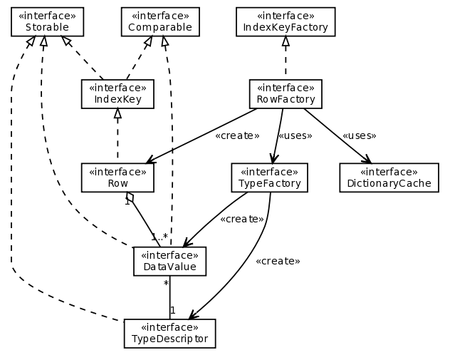

.. -*- coding: utf-8 -*-

====================
SimpleDBM TypeSystem
====================

:Author: Dibyendu Majumdar
:Contact: d.majumdar@gmail.com
:Version: 1.0.x
:Date: 05 July 2008
:Copyright: Copyright by Dibyendu Majumdar, 2008

.. contents::

------------
Introduction
------------

Overview
========

SimpleDBM_ is a transactional database engine, written in Java. It has a
very small footprint and can be embedded in the address space of an
application. It provides a simple Java application programming interface (API), which can be learned very quickly.

.. _SimpleDBM: http://www.simpledbm.org

Features
========

SimpleDBM has the following features:

- *Transactional* - SimpleDBM fully supports ACID transactions. A STEAL and NO-FORCE buffer mangement strategy is used for transactions which is optimum for performance.
- *Multi-threaded* - SimpleDBM is multi-threaded and supports concurrent reads and writes of data.
- *Write Ahead Log* - SimpleDBM uses a write ahead log to ensure transaction recovery in the event of system crashes.
- *Lock based concurrency* - SimpleDBM uses row-level shared, update and exclusive locks to manage concurrency. 
- *Multiple Isolation Levels* - SimpleDBM supports read committed, repeatable read, and serializable isolation levels.
- *B-Tree Indexes* - SimpleDBM implements B-plus Tree indexes, that fully support concurrent reads, inserts and deletes. SimpleDBM B-Trees continually rebalance themselves, and do not suffer from fragmentation.
- *Tables* - SimpleDBM supports tables, but for maximum flexibility, treats table rows as blobs of data. Table rows can have any internal structure as you like, and can span multiple disk pages.
- *Latches and Locks* - SimpleDBM uses latches for internal consistency, and locks for concurrency. Latches are more efficient locking mechanisms that do not suffer from deadlocks.
- *Deadlock detection* - SimpleDBM has support for deadlock detection. A background thread periodically checks the lock table for deadlocks and aborts transactions to resolve deadlocks.

Non-Features
------------
- SimpleDBM is not an SQL engine. 
- There is no support for distributed transactions (XA) yet.

Status
------

SimpleDBM is currently in early BETA and not suitable for Production use. Note that the simpleDBM API is under flux, and is likely to change until the final 1.0 release is available. 

The latest builds can be downloaded from:

http://code.google.com/p/simpledbm/downloads/list.

--------------------
SimpleDBM TypeSystem
--------------------

Introduction
============

SimpleDBM has a modular architecture. The core of the database engine is
in the RSS module. A feature of the engine is that it has no knowledge of 
data types. This is deliberate, to ensure the greatest flexibility. The RSS
only cares about the "sortability" and "persistability" of data. It doesn't
really care about the internal structure of the data.

From a user perspective, the RSS is fairly low level. It requires a fair
amount of work to use the low level API. For instance, the developer has
to worry about how to implement various types, and how to integrate the
types into SimpleDBM. This may be exactly what is needed for someone who
wishes to use very specialized data types, but for the majority of users,
this is too much complexity.

The SimpleDBM-TypeSystem module adds a type system module that can
be used with SimpleDBM. It is currently at experimental stage, and is 
evolving. 

TypeSystem Classes
==================
The overall design of the TypeSystem API is shown in a simplified form in
the class diagram below:

The main classes and their purposes are described below:

Row
  represents a table or index row. A row consists of a number of
  column (Field) objects which are accessed by position.
  
DictionaryCache
  implements the Dictionary Cache where row types can be
  registered, and later on retrieved by container ID.   
  
RowFactory
  The RowFactory is responsible for instantiating Rows for 
  tables and indexes.
  
TypeFactory
  is the main interface for generating column data 
  type descriptors (TypeDescriptor). It provides methods for creating
  various types. 
  
TypeDescriptor 
  holds details of the type definition. At present, only
  following four types are available: Varchar, Number, DateTime and
  Integer.

DataValue
  this is the column value. Sub-classes implement the actual
  behavior. DataValue provides a consistent interface for comparison, 
  assignment and reference. 

How it all fits together
========================

A client starts by creating an array of TypeDescriptor objects.
This array represents the row type for a table or an index container.::

  TypeFactory typeFactory = TypeSystemFactory.getDefaultTypeFactory();
  TypeDescriptor[] rowtype1 = new TypeDescriptor[] {
    typeFactory.getIntegerType(), typeFactory.getVarcharType(10)
  };

In the example shown above, a row type is created with one
integer column and one Varchar column of length 10 characters.

The next step is to register the row type so that it can be
accessed by clients. This is done as shown below::

  RowFactory rowFactory = TypeSystemFactory.getDefaultRowFactory(typeFactory);
  rowFactory.registerRowType(1, rowtype1);

Here the row type is being registered for container ID 1.

Whenever it is necessary to construct a new Row object for
container 1, the following code can be invoked::

  Row row = rowFactory.newRow(1);

By default all the column values in the Row are set to NULL.
NULL is a special state in the Field's value.

Column values can be accessed via the getColumnvalue() method provided 
by the Row interface. The column's value can be changed using 
one of the setter methods implemented by the underlying DataValue 
object. Example::

  DataValue firstColumn = row.getColumnValue(0);
  DataValue secondColumn = row.getColumnValue(1);

  firstColumn.setInt(5); // set column value 
  secondColumn.setString("Hello world!");
  
Note that column positions start at 0. 

About Data Values
==================
A DataValue can be in one of four states:

* Positive Infinity - this is a logical value that is greater than
  any other value of the column. 
  
* Negative Infinity - the converse of Positive Infinity, this
  represents the lowest possible value.
  
* Null - this represents the Null value.

* Value - this signifies that there is a real value in the
  column which is not Null and not one of the Infinity
  values.

DataValues are sortable. That makes Rows sortable as well.

Integration with SimpleDBM RSS Module
=====================================
The TypeSystem integrates with SimpleDBM RSS in following ways:

* RowFactory is a sub-class of IndexKeyFactory. Therefore RowFactory can
  be used wherever IndexKeyFactory is required.
  
* Row is a sub-class of IndexKey and Storable. Therefore, Row
  objects can be used as Tuple values as well as Index key 
  values.

* GenericRowFactory is an implementation of RowFactory that can
  be registered with SimpleDBM as a factory for index keys and
  table rows. 

Samples
=======
The following samples show how the TypeSystem may be used:

* TupleDemo - demonstrates the raw SimpleDBM RSS API and shows
  how the TypeSystem may be integrated with it.
  
* BTreeDemo - demonstrates standalone use of BTrees.

