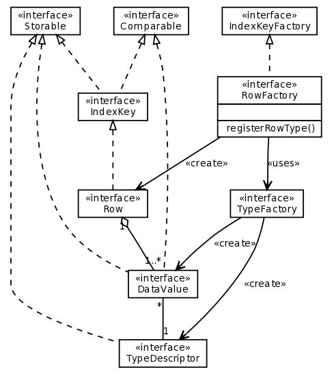

.. -*- coding: utf-8 -*-

======================
SimpleDBM Database API
======================

:Author: Dibyendu Majumdar
:Contact: d.majumdar@gmail.com
:Version: 1.0.x
:Date: 05 July 2008
:Copyright: Copyright by Dibyendu Majumdar, 2008

.. contents::

------------
Introduction
------------

Overview
========

SimpleDBM_ is a transactional database engine, written in Java. It has a
very small footprint and can be embedded in the address space of an
application. It provides a simple Java application programming interface (API), which can be learned very quickly.

.. _SimpleDBM: http://www.simpledbm.org

Features
========

SimpleDBM has the following features:

- *Transactional* - SimpleDBM fully supports ACID transactions. A STEAL and NO-FORCE buffer mangement strategy is used for transactions which is optimum for performance.
- *Multi-threaded* - SimpleDBM is multi-threaded and supports concurrent reads and writes of data.
- *Write Ahead Log* - SimpleDBM uses a write ahead log to ensure transaction recovery in the event of system crashes.
- *Lock based concurrency* - SimpleDBM uses row-level shared, update and exclusive locks to manage concurrency. 
- *Multiple Isolation Levels* - SimpleDBM supports read committed, repeatable read, and serializable isolation levels.
- *B-Tree Indexes* - SimpleDBM implements B-plus Tree indexes, that fully support concurrent reads, inserts and deletes. SimpleDBM B-Trees continually rebalance themselves, and do not suffer from fragmentation.
- *Tables* - SimpleDBM supports tables, but for maximum flexibility, treats table rows as blobs of data. Table rows can have any internal structure as you like, and can span multiple disk pages.
- *Latches and Locks* - SimpleDBM uses latches for internal consistency, and locks for concurrency. Latches are more efficient locking mechanisms that do not suffer from deadlocks.
- *Deadlock detection* - SimpleDBM has support for deadlock detection. A background thread periodically checks the lock table for deadlocks and aborts transactions to resolve deadlocks.

Non-Features
------------
- SimpleDBM is not an SQL engine. 
- There is no support for distributed transactions (XA) yet.

Status
------

SimpleDBM is currently in early BETA and not suitable for Production use. Note that the simpleDBM API is under flux, and is likely to change until the final 1.0 release is available. 

The latest builds can be downloaded from:

http://code.google.com/p/simpledbm/downloads/list.

---------------
Getting Started
---------------

A SimpleDBM server is a set of background threads and a library of API
calls that clients can hook into. The background threads take care of
various tasks, such as writing out buffer pages, writing out logs,
archiving older log files, creating checkpoints, etc.

A SimpleDBM server operates on a set of data and index files, known as
the SimpleDBM database.

Only one server instance is allowed to access a SimpleDBM database at
any point in time. SimpleDBM uses a lock file to detect multiple
concurrent access to a database, and will refuse to start if it
detects that a server is already accessing a database.

Internally, SimpleDBM operates on logical entities called Storage
Containers. From an implementation point of view, Storage Containers
are mapped to files. 

Tables and Indexes are stored in Containers known as TupleContainers
and IndexContainers, respectively.

The SimpleDBM database initially consists of a set of transaction log
files, a lock file and a special container used internally by
SimpleDBM.

Creating a SimpleDBM database
=============================

A SimpleDBM database is created by a call to DatabaseFactory.create(), 
as shown below: ::

  import org.simpledbm.database.api.Database;
  ...  
  Properties properties = new Properties();
  properties.setProperty("log.ctl.1", "ctl.a");
  properties.setProperty("log.ctl.2", "ctl.b");
  properties.setProperty("log.groups.1.path", ".");
  properties.setProperty("log.archive.path", ".");
  properties.setProperty("log.group.files", "3");
  properties.setProperty("log.file.size", "16384");
  properties.setProperty("log.buffer.size", "16384");
  properties.setProperty("log.buffer.limit", "4");
  properties.setProperty("log.flush.interval", "5");
  properties.setProperty("storage.basePath", 
    "demodata/TupleDemo1");
  
  DatabaseFactory.create(properties);

The DatabaseFactory.create() method accepts a Properties object as
the sole argument. The Properties object can be used to pass a
number of parameters. The available options are shown below:

Server Options
--------------

+-----------------------------------+------------------------------------------------------------+
| Property Name                     | Description                                                |
+===================================+============================================================+
| ``log.ctl.{n}``                   | The fully qualified path to the                            |
|                                   | log control file. The first file should be specified as    |
|                                   | ``log.ctl.1``, second as ``log.ctl.2``, and so on. Up to a |
|                                   | maximum of 3 can be specified. Default is 2.               |
+-----------------------------------+------------------------------------------------------------+
| ``log.groups.{n}.path``           | The path where log files of a group should be stored.      |
|                                   | The first log group is specified as ``log.groups.1.path``, |
|                                   | the second as ``log.groups.2.path``,                       |
|                                   | and so on. Up to a maximum of 3 log groups can be          |
|                                   | specified. Default number of groups is 1. Path defaults    |
|                                   | to current directory.                                      |
+-----------------------------------+------------------------------------------------------------+
| ``log.archive.path``              | Defines the path for storing archive files. Defaults to    | 
|                                   | current directory.                                         |
+-----------------------------------+------------------------------------------------------------+
| ``log.group.files``               | Specifies the number of log files within each group.       |
|                                   | Up to a maximum of 8 are allowed. Defaults to 2.           |
+-----------------------------------+------------------------------------------------------------+
| ``log.file.size``                 | Specifies the size of each log file in                     |
|                                   | bytes. Default is 2 KB.                                    |
+-----------------------------------+------------------------------------------------------------+
| ``log.buffer.size``               | Specifies the size of the log buffer                       |
|                                   | in bytes. Default is 2 KB.                                 |
+-----------------------------------+------------------------------------------------------------+
| ``log.buffer.limit``              | Sets a limit on the maximum number of                      |
|                                   | log buffers that can be allocated. Default is 10 *         |
|                                   | log.group.files.                                           |
+-----------------------------------+------------------------------------------------------------+
| ``log.flush.interval``            | Sets the interval (in seconds)                             |
|                                   | between log flushes. Default is 6 seconds.                 |
+-----------------------------------+------------------------------------------------------------+
| ``log.explicitFlushRequests``     | Boolean value, if set, disables                            |
|                                   | log flushes requested explicitly by the Buffer Manager     |
|                                   | or Transaction Manager. Log flushes still occur during     |
|                                   | checkpoints and log switches. By reducing the log flushes, |
|                                   | performance is improved, but transactions may not be       |
|                                   | durable. Only those transactions will survive a system     | 
|                                   | crash that have all their log records on disk.             |
+-----------------------------------+------------------------------------------------------------+
| ``storage.basePath``              | Defines the base location of the                           |
|                                   | SimpleDBM database. All files and directories are created  |
|                                   | relative to this location.                                 |
+-----------------------------------+------------------------------------------------------------+
| ``storage.createMode``            | Defines mode in which files will be                        |
|                                   | created. Default is ``"rws"``.                             |
+-----------------------------------+------------------------------------------------------------+
| ``storage.openMode``              | Defines mode in which files will be                        |
|                                   | opened. Default is ``"rws"``.                              |
+-----------------------------------+------------------------------------------------------------+
| ``bufferpool.numbuffers``         | Sets the number of buffers to be created in                |
|                                   | the Buffer Pool.                                           |
+-----------------------------------+------------------------------------------------------------+
| ``bufferpool.writerSleepInterval``| Sets the interval in milliseconds between each run of      |
|                                   | the BufferWriter. Note that BufferWriter may run earlier   |
|                                   | than the specified interval if the pool runs out of        |
|                                   | buffers, and a new page has to be read in. In such cases,  |
|                                   | the Buffer Writer may be manually triggered to clean out   |
|                                   | buffers.                                                   |
+-----------------------------------+------------------------------------------------------------+
| ``logging.properties.file``       | Specifies the name of logging properties file. Precede     |
|                                   | ``classpath:`` if you want SimpleDBM to search for this    |
|                                   | file in the classpath.                                     |
+-----------------------------------+------------------------------------------------------------+
| ``logging.properties.type``       | Specify ``"log4j"`` if you want to SimpleDBM to use Log4J  |
|                                   | for generating log messages.                               |
+-----------------------------------+------------------------------------------------------------+

The DatabaseFactory.create() call will overwrite any existing database
in the specified storage path, so it must be called only when you know
for sure that you want to create a database.

Opening a database
==================

Once a database has been created, it can be opened by creating an
instance of SimpleDBM server, and starting it. The same properties that were
supplied while creating the database, can be supplied when starting it.

Here is a code snippet that shows how this is done: ::

  Properties properties = new Properties();
  properties.setProperty("log.ctl.1", "ctl.a");
  properties.setProperty("log.ctl.2", "ctl.b");
  properties.setProperty("log.groups.1.path", ".");
  properties.setProperty("log.archive.path", ".");
  properties.setProperty("log.group.files", "3");
  properties.setProperty("log.file.size", "16384");
  properties.setProperty("log.buffer.size", "16384");
  properties.setProperty("log.buffer.limit", "4");
  properties.setProperty("log.flush.interval", "5");
  properties.setProperty("storage.basePath", 
    "demodata/TupleDemo1");

  Database db = DatabaseFactory.getDatabase(getServerProperties());
  db.start();  
  try {
    // do some work
  }
  finally {
    db.shutdown();
  }

Some points to bear in mind when starting SimpleDBM server instances:

1. Make sure that you invoke ``shutdown()`` eventually to ensure proper
   shutdown of the database.
2. Database startup/shutdown is relatively expensive, so do it only
   once during the life-cycle of your application.
3. A Database object can be used only once - after calling
   ``shutdown()``, it is an error to do any operation with the server
   object.

Managing log messages
=====================

SimpleDBM has support for JDK 1.4 style logging as well as
Log4J logging. By default, if Log4J library is available on the
classpath, SimpleDBM will use it. Otherwise, JDK 1.4 util.logging
package is used.

You can specify the type of logging to be used using the
Server Property ``logging.properties.type``. If this is set to
"log4j", SimpleDBM will use Log4J logging. Any other value causes
SimpleDBM to use defauft JDK logging.

The configuration of the logging can be specified using a 
properties file. The name and location of the properties file
is specified using the Server property ``logging.properties.file``.
If the filename is prefixed with the string "classpath:", then
SimpleDBM will search for the properties file in the classpath. 
Otherwise, the filename is searched for in the current filesystem.

A sample logging properties file is shown below. Note that this
sample contains both JDK style and Log4J style configuration.::

 ############################################################
 #  	JDK 1.4 Logging
 ############################################################
 handlers= java.util.logging.FileHandler, java.util.logging.ConsoleHandler
 .level= INFO

 java.util.logging.FileHandler.pattern = simpledbm.log.%g
 java.util.logging.FileHandler.limit = 50000
 java.util.logging.FileHandler.count = 1
 java.util.logging.FileHandler.formatter = java.util.logging.SimpleFormatter
 java.util.logging.FileHandler.level = ALL

 java.util.logging.ConsoleHandler.formatter = java.util.logging.SimpleFormatter
 java.util.logging.ConsoleHandler.level = ALL

 org.simpledbm.rss.impl.registry.level = INFO
 org.simpledbm.rss.impl.bm.level = INFO
 org.simpledbm.rss.impl.im.btree.level = INFO
 org.simpledbm.rss.impl.st.level = INFO
 org.simpledbm.rss.impl.wal.level = INFO
 org.simpledbm.rss.impl.locking.level = INFO
 org.simpledbm.rss.impl.fsm.level = INFO
 org.simpledbm.rss.impl.sp.level = INFO
 org.simpledbm.rss.impl.tx.level = INFO
 org.simpledbm.rss.impl.tuple.level = INFO
 org.simpledbm.rss.impl.latch.level = INFO
 org.simpledbm.rss.impl.pm.level = INFO
 org.simpledbm.rss.util.level = INFO
 org.simpledbm.rss.util.logging.level = INFO
 org.simpledbm.rss.main.level = INFO

 # Default Log4J configuration

 # Console appender
 log4j.appender.A1=org.apache.log4j.ConsoleAppender
 log4j.appender.A1.layout=org.apache.log4j.PatternLayout
 log4j.appender.A1.layout.ConversionPattern=%d [%t] %p %c %m%n

 # File Appender
 log4j.appender.A2=org.apache.log4j.RollingFileAppender
 log4j.appender.A2.MaxFileSize=10MB
 log4j.appender.A2.MaxBackupIndex=1
 log4j.appender.A2.File=simpledbm.log
 log4j.appender.A2.layout=org.apache.log4j.PatternLayout
 log4j.appender.A2.layout.ConversionPattern=%d [%t] %p %c %m%n

 # Root logger set to DEBUG using the A1 and A2 appenders defined above.
 log4j.rootLogger=DEBUG, A1, A2

 # Various loggers
 log4j.logger.org.simpledbm.rss.impl.registry=INFO
 log4j.logger.org.simpledbm.rss.impl.bm=INFO
 log4j.logger.org.simpledbm.rss.impl.im.btree=INFO
 log4j.logger.org.simpledbm.rss.impl.st=INFO
 log4j.logger.org.simpledbm.rss.impl.wal=INFO
 log4j.logger.org.simpledbm.rss.impl.locking=INFO
 log4j.logger.org.simpledbm.rss.impl.fsm=INFO
 log4j.logger.org.simpledbm.rss.impl.sp=INFO
 log4j.logger.org.simpledbm.rss.impl.tx=INFO
 log4j.logger.org.simpledbm.rss.impl.tuple=INFO
 log4j.logger.org.simpledbm.rss.impl.latch=INFO
 log4j.logger.org.simpledbm.rss.impl.pm=INFO
 log4j.logger.org.simpledbm.rss.util=INFO
 log4j.logger.org.simpledbm.rss.util.logging=INFO
 log4j.logger.org.simpledbm.rss.main=INFO

By default, SimpleDBM looks for a logging properties file named
"simpledbm.logging.properties".

--------------------
SimpleDBM TypeSystem
--------------------

Introduction
============

SimpleDBM has a modular architecture. The core of the database engine is
in the RSS module. A feature of the engine is that it has no knowledge of 
data types. This is deliberate, to ensure the greatest flexibility. The RSS
only cares about the "sortability" and "persistability" of data. It doesn't
really care about the internal structure of the data.

From a user perspective, the RSS is fairly low level. It requires a fair
amount of work to use the low level API. For instance, the developer has
to worry about how to implement various types, and how to integrate the
types into SimpleDBM. This may be exactly what is needed for someone who
wishes to use very specialized data types, but for the majority of users,
this is too much complexity.

The SimpleDBM-TypeSystem module adds a type system module that can
be used with SimpleDBM. It is currently at experimental stage, and is 
evolving. 

TypeSystem Classes
==================
The overall design of the TypeSystem API is shown in a simplified form in
the class diagram below:

The main classes and their purposes are described below:

* Row - represents a table or index row. A row consists of a number of
  column (Field) objects which are accessed by position.
  
* RowFactory - implements the Dictionary Cache where row types can be
  registered, and later on retrieved by container ID. The RowFactory 
  is also responsible for instantiating Rows for containers.
  
* TypeFactory - is the main interface for generating column data 
  type descriptors (TypeDescriptor). It provides methods for creating
  various types. 
  
* TypeDescriptor holds details of the type definition. At present, only
  following four types are available: Varchar, Number, DateTime and
  Integer.

* DataValue - this is the column value. Sub-classes implement the actual
  behavior. DataValue provides a consistent interface for comparison, 
  assignment and reference. 

How it all fits together
========================

A client starts by creating an array of TypeDescriptor objects.
This array represents the row type for a table or an index container.::

  TypeFactory typeFactory = new DefaultTypeFactory();
  TypeDescriptor[] rowtype1 = new TypeDescriptor[] {
    typeFactory.getIntegerType(), typeFactory.getVarcharType(10)
  };

In the example shown above, a row type is created with one
integer column and one Varchar column of length 10 characters.

The next step is to register the row type so that it can be
accessed by clients. This is done as shown below::

  RowFactory rowFactory = new GenericRowFactory(fieldFactory);
  rowFactory.registerRowType(1, rowtype1);

Here the row type is being registered for container ID 1.

Whenever it is necessary to construct a new Row object for
container 1, the following code can be invoked::

  Row row = rowFactory.newRow(1);

By default all the column values in the Row are set to NULL.
NULL is a special state in the Field's value.

Column values can be accessed via the get() method provided 
by the Row interface. The column's value can be changed using 
one of the setter methods implemented by the underlying Field 
object. Example::

  DataValue firstColumn = row.getColumnValue(0);
  DataValue secondColumn = row.getColumnValue(1);

  firstColumn.setInt(5); // set column value 
  secondColumn.setString("Hello world!");
  
Note that column positions start at 0. 

About Data Values
==================
A column value can be in one of four states:

* Positive Infinity - this is a logical value that is greater than
  any other value of the column. 
  
* Negative Infinity - the converse of Positive Infinity, this
  represents the lowest possible value.
  
* Null - this represents the Null value.

* Value - this signifies that there is a real value in the
  column which is not Null and not one of the Infinity
  values.

By definition, columns are sortable. That makes Rows
sortable as well.

Integration with SimpleDBM RSS Module
=====================================
The TypeSystem integrates with SimpleDBM RSS in following ways:

* RowFactory is a sub-class of IndexKeyFactory. Therefore RowFactory can
  be used wherever IndexKeyFactory is required.
  
* Row is a sub-class of IndexKey and Storable. Therefore, Row
  objects can be used as Tuple values as well as Index key 
  values.

* GenericRowFactory is an implementation of RowFactory that can
  be registered with SimpleDBM as a factory for index keys and
  table rows. 

------------
Transactions
------------

Most SimpleDBM operations take place in the context of a Transaction.
Following are the main API calls for managing transactions.

Creating new Transactions
=========================

To start a new Transaction, invoke the ``Server.begin()`` method as
shown below. You must supply an ``IsolationMode``, try
``READ_COMMITTED`` to start with.::

 Server server = ...;

 // Start a new Transaction
 Transaction trx = server.begin(IsolationMode.READ_COMMITTED);

Isolation Modes are discussed in more detail in `Isolation Modes`_.

Working with Transactions
=========================

Transaction API
---------------

The Transaction interface provides the following methods for clients
to invoke: ::

 public interface Transaction {
 	
   /**
    * Creates a transaction savepoint.
    */
   public Savepoint createSavepoint(boolean saveCursors);
 
   /**
    * Commits the transaction. All locks held by the
    * transaction are released.
    */
   public void commit();	
 
   /**
    * Rolls back a transaction upto a savepoint. Locks acquired
    * since the Savepoint are released. PostCommitActions queued
    * after the Savepoint was created are discarded.
    */
   public void rollback(Savepoint sp);	
 
   /**
    * Aborts the transaction, undoing all changes and releasing 
    * locks.
    */
   public void abort();
 
 }

A transaction must always be either committed or aborted. Failure to
do so will lead to resource leaks, such as locks, which will not be
released.  The correct way to work with transactions is shown below: ::

 // Start a new Transaction
 Transaction trx = server.begin(IsolationMode.READ_COMMITTED);
 boolean success = false;
 try {
   // do some work and if this is completed succesfully ...
   // set success to true.
   doSomething();
   success = true;
 }
 finally {
   if (success) {
     trx.commit();
   }
   else {
     trx.abort();
   }
 }

Transaction Savepoints
----------------------

You can create transaction savepoints at any point in time.  When you
create a savepoint, you need to decide whether the scans associated
with the transaction should save their state so that in the event of
a rollback, they can be restored to the state they were in at
the time of the savepoint. This is important if you intend to use the
scans after you have performed a rollback to savepoint.

Bear in mind that in certain IsolationModes, locks are released as the
scan cursor moves, When using such an IsolationMode, rollback to a
Savepoint can fail if after the rollback, the scan cursor cannot be
positioned on a suitable location, for example, if a deadlock occurs when
it attempts to reacquire lock on the previous location. Also, in case
the location itself is no longer valid, perhaps due to a delete
operation by some other transaction, then the scan may position itself
on the next available location.

If you are preserving cursor state during savepoints, be prepared that
in certain IsolationModes, a rollback may fail due to locking, or the
scan may not be able to reposition itself on exactly the same
location.

------
Tables
------

SimpleDBM provides support for tables with variable length rows.
The container for a table is known as ``TupleContainer``.  

A table row is defined by the interface Row, previously described
in the section on TypeSystem.

Creating a Table and Indexes
============================

When you create a ``TupleContainer``, you must supply a name for the
container, a unique numeric ID which should not be in use by any other
container, and the extent size. For efficiency, SimpleDBM allocates
space in extents; an extent is simply a set of contiguous pages.::

 /**
  * Creates a new Tuple Container. 
  * 
  * @param trx Transaction to be used for creating the container
  * @param name Name of the container
  * @param containerId A numeric ID for the container - must 
  *                    be unique for each container
  * @param extentSize The number of pages that should be part 
  *                   of each extent in the container
  */
 public void createTupleContainer(Transaction trx, String name,
  int containerId, int extentSize);

Note that the ``createTupleContainer()`` method requires a Transaction.
Given below is an example of how a tuple container may be created.
In this instance, we are creating a TupleContainer named "test.db", which
will be assigned container ID 1, and will have an extent size of 20 pages.::

 Transaction trx = server.begin(IsolationMode.READ_COMMITTED);
 boolean success = false;
 try {
   server.createTupleContainer(trx, "test.db", 1, 20);
   success = true;
 }
 finally {
   if (success)
     trx.commit();			
   else 
     trx.abort();
 }

Note: 
  When you create a Container it is exclusively locked. The lock
  is released when you commit or abort the transaction. The exclusive lock
  prevents any other transaction from manipulating the container while it is
  being created.

Recommendation: 
  You should create standalone transactions for creating
  containers, and commit the transaction as soon as the container has been
  created.

Accessing a TupleContainer
==========================

To manipulate a ``TupleContainer``, you must first get access to it. This
is done by invoking the ``getTupleContainer()`` method provided by the
SimpleDBM Server object. Note that when you access a ``TupleContainer`` in
this way, a shared lock is placed on the container. This prevents
other transactions from deleting the container while you are working
with it. However, other transactions can perform row level operations
on the same container concurrently.::

 Server server ...
 
 Transaction trx = server.begin(IsolationMode.READ_COMMITTED);
 try {
   boolean success = false      
   TupleContainer container = server.getTupleContainer(trx, 1);
   // do something
   success = true;
 }
 finally {
   if (success)
     trx.commit();
   else
     trx.abort();
 }

Inserting tuples
================

SimpleDBM treats tuples (rows) as blobs of data, and does not care
about the internal structure of a tuple. The only requirement is that
a tuple must implement the ``Storable`` interface.

An insert operation is split into two steps. In the first step,
the initial chunk of the tuple is inserted and a Location assigned to
the tuple. At this point, you can do other things such as add entries 
to indexes. 

You complete the insert as a second step. At this point, if the tuple
was larger than the space allowed for in the first chunk, additional
chunks get created and allocated for the tuple.

The reason for the two step operation is to ensure that for large
tuples that span multiple pages, the insert does not proceed until it
is certain that the insert will be successful. It is assumed that once
the indexes have been successfully updated, in particular, the primary
key has been created, then the insert can proceed.

In the example below, we insert a tuple of type ``ByteString``, which is
a ``Storable`` wrapper for ``String`` objects.::

 Server server ...
 
 Transaction trx = server.begin(IsolationMode.READ_COMMITTED);
 try {
   boolean success = false      
   TupleContainer container = server.getTupleContainer(trx, 1);
   TupleInserter inserter = 
     container.insert(trx, new ByteString("Hello World!"));
   Location location = inserter.getLocation();
  
   // Create index entires here
 
   inserter.completeInsert();
   success = true;
 }
 finally {
   if (success)
     trx.commit();
   else
     trx.abort();
 }

Reading tuples
==============

In order to read tuples, you must open a scan. A scan is a mechanism
for accessing tuples one by one. You can open Index Scans (described
in next chapter) or Tuple Scans. A Tuple Scan directly scans a
TupleContainer.  Compared to index scans, tuple scans are unordered,
and do not support Serializable or Repeatable Read lock modes. Another
limitation at present is that tuple scans do not save their state
during savepoints, and therefore cannot restore their state in the event of
a rollback to a savepoint.::

 Server server ...
 
 Transaction trx = server.begin(IsolationMode.READ_COMMITTED);
 try {
   boolean success = false      
   TupleContainer container = server.getTupleContainer(trx, 1);
   TupleScan scan = container.openScan(trx, false);
   while (scan.fetchNext()) {
     byte[] data = scan.getCurrentTuple();
     // Do somthing with the tuple data
   }
   success = true;
 }
 finally {
   if (success)
     trx.commit();
   else
     trx.abort();
 }

Updating tuples
===============

In order to update a tuple, you must first obtain its Location using a
scan. typically, if you intend to update the tuple, you should open the
scan in UPDATE mode. This is done by supplying a boolean true as the
second argument to ``openScan()`` method.

Note that in the current implementation of SimpleDBM, the space
allocated to a tuple is never reduced, even if the tuple grows smaller
due to updates.::

 Server server ...
 
 Transaction trx = server.begin(IsolationMode.READ_COMMITTED);
 try {
   boolean success = false      
   TupleContainer container = server.getTupleContainer(trx, 1);
   TupleScan scan = container.openScan(trx, true);
   while (scan.fetchNext()) {
     Location location = scan.getCurrentLocation();
     byte[] data = scan.getCurrentTuple();
     // Do somthing with the tuple data
     // Assume updatedTuple contains update tuple data.
     Storable updatedTuple = ... ;
     // Update the tuple
     container.update(trx, location, updatedTuple);
   }
   success = true;
 }
 finally {
   if (success)
     trx.commit();
   else
     trx.abort();
  }
 
Deleting tuples
===============
 
Tuple deletes are done in a similar way as tuple updates.
Start a scan in UPDATE mode, if you intend to delete tuples
during the scan. Here is an example: ::
 
 Server server ...
 
 Transaction trx = server.begin(IsolationMode.READ_COMMITTED);
 try {
   boolean success = false      
   TupleContainer container = server.getTupleContainer(trx, 1);
   TupleScan scan = container.openScan(trx, true);
   while (scan.fetchNext()) {
     Location location = scan.getCurrentLocation();
     container.delete(trx, location);
   }
   success = true;
 }
 finally {
   if (success)
     trx.commit();
   else
     trx.abort();
 }

Scanning keys
=============

Isolation Modes
---------------

Before describing how to scan keys within an Index, it is necessary to
describe the various lock isolation modes supported by SimpleDBM.

Common Behaviour
----------------

Following behaviour is common across all lock isolation modes.

1. All locking is on Tuple Locations (rowids) only.
2. When a tuple is inserted or deleted, its Location is first
   locked in EXCLUSIVE mode, the tuple is inserted or deleted from data
   page, and only after that, indexes are modified.
3. Updates to indexed columns are treated as key deletes followed
   by key inserts. The updated row is locked in EXCLUSIVE mode before
   indexes are modified.
4. When fetching, the index is looked up first, which causes a
   SHARED or UPDATE mode lock to be placed on the row, before the data
   pages are accessed.

Read Committed/Cursor Stability
-------------------------------

During scans, the tuple location is locked in SHARED or UPDATE mode
while the cursor is positioned on the key. The lock on current
location is released before the cursor moves to the next key.

Repeatable Read (RR)
--------------------

SHARED mode locks obtained on tuple locations during scans are retained until
the transaction completes. UPDATE mode locks are downgraded to SHARED mode when
the cursor moves.

Serializable
------------

Same as Repeatable Read, with additional locking (next key) during
scans to prevent phantom reads.

Scanning API
------------

Opening an IndexScan requires you to specify a start condition.
If you want to start from the beginning, then you may specify null values
as the start key/location. 

In SimpleDBM, scans do not have a stop key. Instead, a scan starts fetching
data from the first key/location that is greater or equal to the supplied
start key/location. You must determine whether the fetched key satisfies
the search criteria or not. If the fetched key no longer meets the search
criteria, you should call ``fetchCompleted()`` with a false value, indicating that
there is no need to fetch any more keys. This then causes the scan to
reach logical EOF.

The API for index scans is shown below: ::

 public interface IndexContainer {
 	
   /**
    * Opens a new index scan. The Scan will fetch keys >= the 
    * specified key and location. Before returning fetched keys, 
    * the associated Location objects will be locked. The lock 
    * mode depends upon the forUpdate flag. The IsolationMode
    * of the transaction determines when lock are released. 
    * 
    * Caller must obtain a Shared lock on the Index Container 
    * prior to calling this method.
    * 
    * @param trx Transaction that will manage locks obtained 
    *            by the scan
    * @param key The starting key to be searched for
    * @param location The starting location to be searched for.
    * @param forUpdate If this set, UPDATED mode locks will 
    *                  be acquired, else SHARED mode locks will
    *                  be acquired.
    */
   public IndexScan openScan(Transaction trx, IndexKey key, 
     Location location, boolean forUpdate);	
 	
 }
 
 
 public interface IndexScan {
 	
   /**
    * Fetches the next available key from the Index. 
    * Handles the situation where current key has been deleted.
    * Note that prior to returning the key the Location 
    * object associated with the key is locked.
    * After fetching an index row, typically, data must 
    * be fetched from associated tuple container. Locks 
    * obtained by the fetch protect such access. After 
    * tuple has been fetched, caller must invoke 
    * fetchCompleted() to ensure that locks are released 
    * in certain lock isolation modes. Failure to do so will 
    * cause extra locking.
    */
   public boolean fetchNext();
 	
   /**
    * In certain isolation modes, releases locks acquired 
    * by fetchNext(). Must be invoked after the data from 
    * associated tuple container has been fetched.
    * If the argument matched is set to false, the scan 
    * is assumed to have reached eof of file. The next
    * call to fetchNext() will return false.
    * 
    * @param matched If set to true indicates that the 
    *                key satisfies search query
    */
   public void fetchCompleted(boolean matched);
 	
   /**
    * Returns the IndexKey on which the scan is currently 
    * positioned.
    */
   public IndexKey getCurrentKey();
 	
   /**
    * Returns the Location associated with the current 
    * IndexKey.
    */
   public Location getCurrentLocation();
 	
   /**
    * After the scan is completed, the close method 
    * should be called to release all resources acquired 
    * by the scan.
    */
   public void close();
 	
   /**
    * Returns the End of File status of the scan. Once 
    * the scan has gone past the last available key in 
    * the Index, this will return true.  
    */
   public boolean isEof();
 }

Following code snippet, taken from the btreedemo sample,
shows how to implement index scans.::

 Transaction trx = ...;
 IndexContainer indexContainer = ...;
 IndexScan scan = indexContainer.openScan(trx, null, 
   null, false);
 try {
   while (scan.fetchNext()) {
     System.err.println("SCAN NEXT=" + scan.getCurrentKey() + 
       "," + scan.getCurrentLocation());
     scan.fetchCompleted(true);
   }
 } finally {
   if (scan != null) {
     scan.close();
   }
 }

Another example of an index scan can be found in section `Deleting a key`_.

